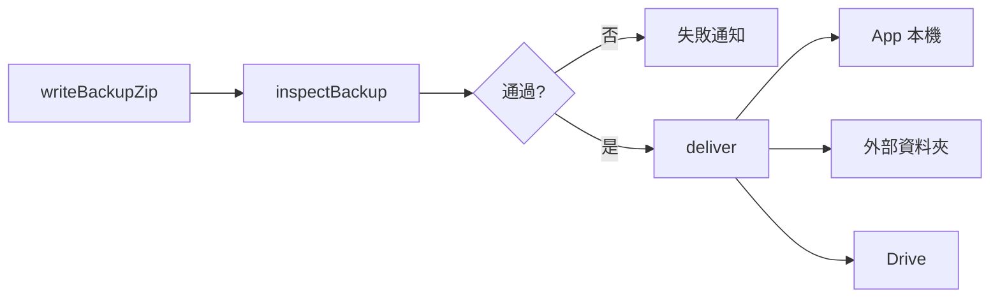

# 備份與還原

這份文件整理 Quill Diary 目前的備份、還原與可攜式匯入匯出行為。

重點只有三件事：

- 完整備份如何封裝整個日記庫
- 還原時會怎麼覆寫與重建
- 可攜式匯入匯出和完整備份有什麼本質差異

這份文件先聚焦本機與外部流程，不把 Google Drive 當主線。

## 先講結論

Quill Diary 有兩種不同用途的資料輸出方式：

- **完整備份**：用來保存整個加密日記庫，供之後完整還原
- **可攜式匯出**：用來把日記帶出去閱讀、整理或匯入，不會直接還原整個 `vault/`

這兩者不能混用。

## 前置條件

設定頁中的備份、還原、匯入與匯出，前提都是：

- 日記庫已解鎖
- 已建立復原金鑰

Google Drive 帳號連結不在這份文件主線內，而且它本身不要求先解鎖。

## 完整備份

完整備份會把目前的 `vault/` 封裝成一個 `backup_*.zip`。

重點：

- 只封裝正式日記庫
- **不包含** `drafts/`
- 備份內仍是加密資料，不是明文
- 用途是完整還原，不是做可讀匯出

### 檔名與內容

- 檔名：`backup_YYYY-MM-DD_HH-MM-SS.zip`

```text
backup_*.zip
├── recovery.json
├── manifest.json.enc
├── entries/
├── assets/
└── tag_styles.json
```

### 完整備份管線

本機備份、外部資料夾匯出與雲端備份共用同一條完整備份管線：

1. `writeBackupZip` 建立暫存 zip
2. `inspectBackup` 檢查 zip 結構
3. 檢查通過後才交付到目標位置



這個設計的目的很直接：先確定備份本體可用，再真的交付出去。

### 設定頁中的完整備份操作

| 入口 | 行為 |
|------|------|
| 建立本機備份 | 通過檢查後寫入 App 專用目錄，最多保留 5 份 |
| 從本機備份還原 | 從 App 內清單選取完整備份，走共用還原流程 |
| 匯出備份到資料夾 | 將 `backup_*.zip` 交付到外部資料夾 |
| 匯入外部備份 | 從外部選擇 `backup_*.zip`，走共用還原流程 |

### 外部資料夾交付

Android 外部交付走 SAF 流程。

- 寫入時使用 `ExternalDirectoryPicker` 與 `AndroidSafFileCopy`
- 成功提示只顯示檔名，不直接暴露整段外部路徑
- 從外部還原時則透過檔案選擇器挑選 zip

### 保留份數

- 本機備份會保留最新 5 份
- Google Drive 也是以保留份數概念管理
- 外部資料夾匯出**不會**自動輪替或刪舊檔

## 還原

不論備份來源是 App 內清單還是外部 zip，還原都走同一條流程。

### 共用還原流程

1. `precheckRestore`
2. 顯示覆寫提醒與復原金鑰提示
3. 必要時驗證備份對應的復原金鑰
4. `restoreBackupZip` 覆寫 `vault/`
5. 刪除索引資料庫
6. 重新建立索引
7. 重新啟動並回到可解鎖狀態

### 還原會影響什麼

- 正式日記庫 `vault/` 會被備份內容覆寫
- 搜尋索引會被刪除後重建
- App 會回到重新啟動 / 重新解鎖的狀態

### 還原不會自動處理什麼

- `drafts/` 不在完整備份內
- 還原時不會主動把既有草稿一起清掉

這代表完整備份關心的是正式日記庫，不是編輯中的暫存狀態。

## 可攜式匯入與匯出

可攜式流程和完整備份不同。它不覆寫整個 `vault/`，而是把資料逐篇寫入或匯出。

### 可攜式匯入

`importDocumentsWithPicker` 的方向是把外部內容整理後逐篇寫入加密日記庫。

流程大致如下：

1. 先開啟檔案選擇器，支援 zip、Markdown、HTML
2. 若使用者取消，再改走資料夾挑選
3. 若是 zip，先嘗試辨識 Easy Diary 完整備份
4. 若不是 Easy Diary 備份，則遞迴尋找 Markdown / HTML 文件
5. 匯入內容後逐篇寫入日記庫

補充：

- Easy Diary 匯入只支援 Android
- 已加密的日記檔不走這條路徑，會略過

### 可攜式匯出

| 入口 | 產物 |
|------|------|
| 設定頁「匯出日記」 | `markdown_*.zip` |
| 首頁選取後匯出 HTML | `html_*.html` |

流程：

1. 先在暫存區產生輸出檔
2. 讓使用者選擇外部資料夾
3. 透過 `deliverToExternalDirectory` 交付
4. Android 裝置上由 SAF 完成實際寫入

## 完整備份與可攜式匯出的差異

| 項目 | 完整備份 | 可攜式匯出 |
|------|------|------|
| 主要用途 | 完整保存與還原整個日記庫 | 攜出內容、整理、閱讀或再匯入 |
| 檔名 | `backup_*.zip` | `markdown_*.zip` / `html_*.html` |
| 內容 | 加密的 `vault/` | 解密後的 Markdown / HTML |
| 還原方式 | 直接覆寫 `vault/` | 逐篇匯入 |
| 結構檢查 | `inspectBackup` | 沒有同等的完整備份檢查流程 |

## 與其他模組的邊界

- 完整備份只處理正式日記庫，不包含草稿，請看 [日記編輯器.md](./日記編輯器.md)
- 還原後索引會刪除並重建，請看 [索引資料庫.md](./索引資料庫.md)
- `backup_*.zip` 內封裝的仍是加密資料，格式請看 [加密格式.md](./加密格式.md)

---

[← 返回文件目錄](./文件目錄.md)
