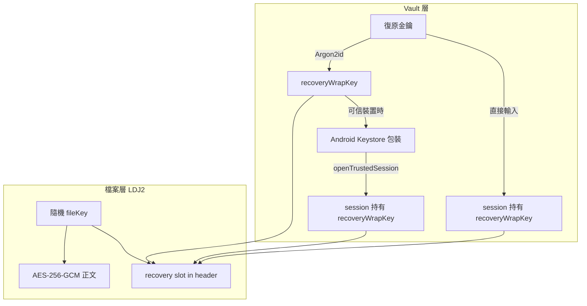
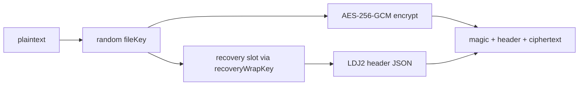

# 加密格式

這份文件整理 Quill Diary 目前使用的 `LDJ2` 加密格式，包括檔案結構、寫入方式、兩層金鑰架構與解密邏輯。

它只說明加密資料本身，不重講 UI 解鎖流程。

## 這個格式在做什麼

`LDJ2` 用來保護日記、附件與其他需要加密保存的內容。

它的核心做法是 **信封加密（envelope encryption）**：

- 每個加密檔案都有自己的隨機 `fileKey`
- 正文用 `AES-256-GCM` 加密
- `fileKey` 以 **recovery slot** 包在檔案 header 內
- 進入整個日記庫的 **recovery wrapping key** 則另外由復原金鑰衍生，並在可信裝置路徑下由 Android Keystore 保護

這代表：可信裝置與復原金鑰都能打開同一份內容，但機制分成 **vault 層** 與 **檔案層** 兩段，而不是在每個檔案 header 裡各放一條 Keystore 路徑。

## 兩層金鑰架構



| 層級 | 金鑰 | 存放位置 | 用途 |
|------|------|----------|------|
| Vault 層 | `recoveryWrapKey` | 由復原金鑰衍生；可信裝置時再被 Keystore 包裝後存於 secure storage | 進入整個日記庫、解開各檔 recovery slot、衍生搜尋索引金鑰 |
| 檔案層 | `fileKey` | 每個 `.enc` 檔案的 recovery slot 內 | 解密該檔正文 |

## 檔案結構

每個加密檔案的格式如下：

```text
[magic "LDJ2" 4B][header length uint32 BE][JSON header][AES-GCM ciphertext + tag]
```

重點：

- magic 固定為 `LDJ2`
- header 使用 JSON
- `schema_version` 目前為 `1`
- 內容加密演算法是 `aes-256-gcm`
- AAD 使用整段 canonical header bytes

最後一點很重要。因為 header 本身會參與驗證，所以如果有人竄改 header，正文驗證也應該失敗。

## 寫入流程



實際寫入時的順序：

1. 產生隨機 `fileKey`
2. 用 `fileKey` 對正文做 `AES-256-GCM` 加密
3. 用目前的 `recoveryWrapKey` 建立 **recovery slot**，把 `fileKey` 包進 header
4. 組出 header
5. 寫成 `magic + header length + header + ciphertext`

寫入時 **不會** 在每個檔案 header 內建立 per-file device slot。可信裝置保護發生在 vault 層，見下文。

## 檔案層 Recovery Slot

`LDJ2` 把每個檔案的 `fileKey` 包進 header 的 recovery slot，而不是直接把解密能力綁在單一輸入上。

| 欄位 | 說明 |
|------|------|
| `slot_type` | 固定為 `recovery` |
| `wrap_algorithm` | `aes-256-gcm` |
| `wrapped_key` | 以 `recoveryWrapKey` 包裝後的 `fileKey` |
| `nonce` | GCM nonce |
| `kdf` | 對應 `recovery.json` 的 KDF 描述，供復原金鑰路徑驗證與衍生 |

### 這代表什麼

- 每個檔案都有自己的 `fileKey`，互不共用
- 只要 session 持有正確的 `recoveryWrapKey`，就能透過 recovery slot 解開各檔
- 復原金鑰路徑與可信裝置路徑，最終都是用同一把 `recoveryWrapKey` 解開檔案層 slot

## Vault 層可信裝置保護

可信裝置不是在每個 `.enc` 檔案裡再包一層 Keystore，而是保護 **整個 vault 的 recovery wrapping key**。

高層流程：

1. 使用者建立復原金鑰時，程式以 Argon2id 衍生 `recoveryWrapKey`
2. `DeviceKeyManager.wrapWithDeviceKey` 把這把 key 包成 `WrappedRecoveryKeyRecord`，存入 secure storage
3. 可信裝置解鎖時，`VaultRepository.openTrustedSession` 透過 Keystore unwrap 取得 `recoveryWrapKey`
4. session 帶著 `recoveryWrapKey` 後，才能讀寫 LDJ2 檔案、草稿與搜尋索引

Keystore 槽可能對應 `plain`、`deviceCredential` 或 `biometric`，依目前解鎖模式決定。UI 解鎖流程見 [解鎖與會話.md](./解鎖與會話.md)。

## Recovery wrapping key

使用者輸入的復原金鑰不會直接拿來解正文。

它會先經過 **Argon2id**，再得到 recovery wrapping key。相關參數記錄在 `recovery.json`。

這把 key 的用途：

- 包裝或解開各檔 **recovery slot** 內的 `fileKey`
- 包裝可信裝置使用的 **wrapped recovery key**（vault 層）
- 衍生搜尋索引資料庫使用的金鑰

可信裝置的本質是：先用 Keystore 解開 vault 層的 wrapped recovery key，取得 `recoveryWrapKey`；之後讀寫各檔時，仍走檔案層 recovery slot。

## 解密邏輯

`decryptBytes` 需要 `DecryptionContext` 提供 `recoveryWrapKey`。不論從可信裝置或復原金鑰進入，檔案層都一律走 header 內的 recovery slot。

### 兩條進入路徑

**可信裝置路徑**

1. `openTrustedSession` 透過 Keystore unwrap vault 層 wrapped recovery key
2. session 取得 `recoveryWrapKey`
3. 對目標檔案：從 recovery slot 解出 `fileKey`
4. 用 `fileKey` 解密正文

**復原金鑰路徑**

1. 使用者輸入復原金鑰，經 Argon2id 衍生 `recoveryWrapKey`
2. 對目標檔案：從 recovery slot 解出 `fileKey`
3. 用 `fileKey` 解密正文

### 失敗條件

- `recoveryWrapKey` 不正確
- recovery slot unwrap 失敗
- header 或正文被竄改
- slot 找不到或格式不符

以上情況都應讓整個解密失敗，不會默默回傳可疑內容。

## Manifest 的角色

`vault/manifest.json.enc` 是復原金鑰驗證時的首選目標。

原因很簡單：它是穩定、固定存在的加密資料之一，適合用來先確認目前的復原金鑰是否能正確打開這個 vault。

若 manifest 不存在，程式才會 fallback 掃描其他可驗證的 `.enc` 檔案。

## 與其他文件的邊界

- 這份文件只講加密資料結構與解密路徑
- 解鎖畫面、timeout、resume、三種解鎖模式與 session 狀態，請看 [解鎖與會話.md](./解鎖與會話.md)
- 搜尋索引金鑰如何衍生與何時開關，請看 [索引資料庫.md](./索引資料庫.md)
- 備份封裝哪些加密資料，請看 [備份與還原.md](./備份與還原.md)

---

[← 返回文件目錄](./文件目錄.md)
