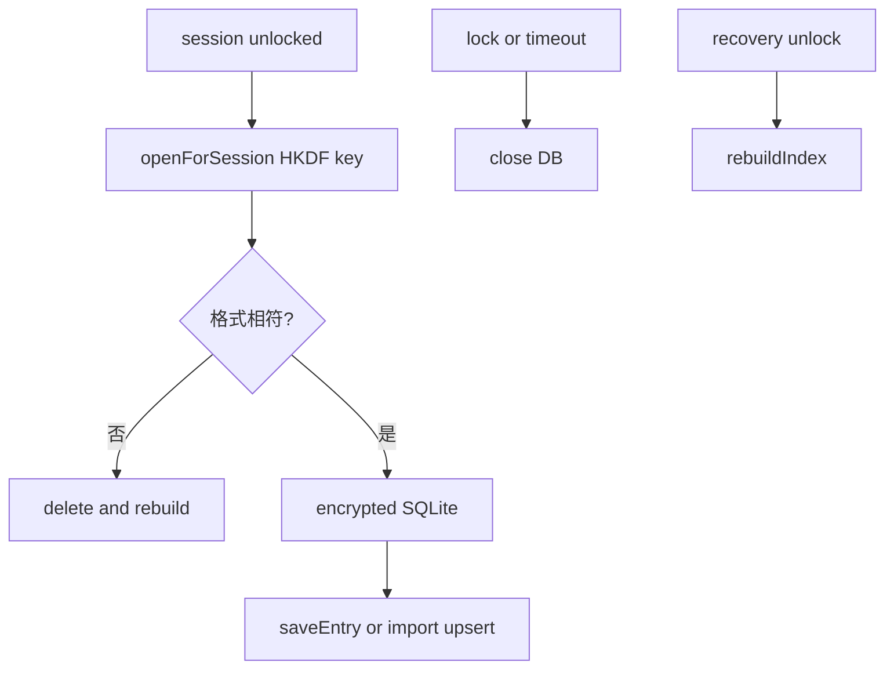

# 索引資料庫

這份文件整理 Quill Diary 的搜尋索引資料庫，包括它為什麼存在、何時開啟、何時同步、何時關閉，以及什麼情況下會重建。

它只講索引本身，不重講解鎖流程、備份全貌或草稿細節。

## 索引資料庫在做什麼

日記的正式資料存在 `vault/`，但搜尋不直接對加密日記逐篇掃描。

Quill Diary 另外維護一份 SQLite 搜尋索引，目的很單純：

- 讓首頁搜尋可以快速查標題、標籤與內文
- 把搜尋用途和正式日記資料分開
- 讓索引可以在必要時直接重建，不影響正式日記內容

這代表索引資料庫是衍生資料，不是權威資料來源。

## 路徑與加密

- 路徑：`{appSupport}/quill_diary/index/journal_index.sqlite`
- 存放位置與 `vault/` 分開
- SQLCipher 金鑰由 `recovery wrapping key + vaultId` 經 HKDF 衍生

索引雖然是衍生資料，但仍屬敏感內容，因此不以明文 SQLite 形式留在裝置上。

## 生命週期

高層原則很簡單：

- 解鎖後才開啟
- 鎖定後就關閉
- 格式不符或需要重建時，直接刪掉再重建

## 何時開啟

`openForSession` 會負責把索引綁到目前的解鎖 session。

實際行為：

1. 若索引已開啟，而且 `vaultId` 相同，直接重用
2. 若不是同一個 session，先 `close()`
3. 檢查索引格式是否相符
4. 若格式不符，刪除舊索引資料庫
5. 以 HKDF 衍生 SQLCipher key
6. 開啟加密 SQLite 並 `initialize()`

## 與 Session 的關係

| 時機 | 動作 |
|------|------|
| 解鎖成功 | 開啟索引 |
| 解鎖後首次需要索引 | `ensureIndexReady()`，必要時重建 |
| 使用復原金鑰完成解鎖 | 強制重建索引 |
| lock / timeout | `close()` |
| 備份還原 | 刪除索引資料庫檔案，之後再重建 |

這裡最重要的原則是：索引只在有效解鎖 session 期間存在可用狀態。

## 何時同步資料

索引不是每次輸入文字就更新，而是跟著正式資料寫入走。

- 草稿編輯中不更新索引
- 正式執行 `saveEntry()` 後才同步索引
- 匯入日記時也透過正式寫入路徑同步，不需要額外補建

所以搜尋看到的永遠是「已正式寫入日記庫」的內容，不包含尚未儲存的草稿。

## 搜尋行為

首頁搜尋目前走單一路徑的字串比對。

命中欄位包括：

- `title_search_text`
- `body_search_text`
- `entry_tags.tag_normalized`

`preview_text` 只用來顯示列表摘要，不參與搜尋。

## 何時重建

索引屬於可重建資料，因此遇到格式或版本問題時，不做複雜遷移，直接重建。

常見情況：

- 索引格式不符
- `search_schema_version` 落後
- 使用復原金鑰重新解鎖後，需要重新建立可信的索引狀態
- 備份還原後，需要從目前 `vault/` 重新掃描建立

這是刻意的設計取向：正式資料留在 `vault/`，索引則可以隨時丟棄再生成。

## 標籤目錄的關係

- 標籤樣式的權威來源是 `vault/tag_styles.json`
- SQLite 內的 `tag_styles` 表只是 accent 顏色快取

也就是說，索引資料庫可以保留搜尋與顯示所需的輔助資料，但不應成為標籤設定的唯一來源。

## 與其他模組的邊界

- 草稿不進索引，請看 [日記編輯器.md](./日記編輯器.md)
- 索引金鑰如何從 recovery wrapping key 衍生，請看 [加密格式.md](./加密格式.md)
- 備份還原怎麼影響索引重建，請看 [備份與還原.md](./備份與還原.md)
- session 何時解鎖、鎖定與恢復，請看 [解鎖與會話.md](./解鎖與會話.md)

---

[← 返回文件目錄](./文件目錄.md)
