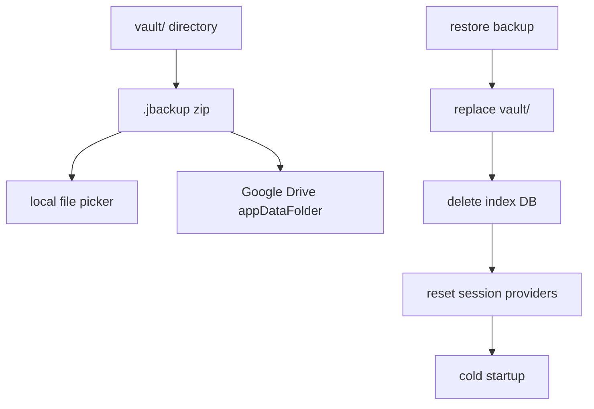

# 備份與還原

本機 `.jbackup` 與 Google Drive 備份、還原後的 App 重置流程。

## 備份 / 還原管線

## 本機備份

- 將 `vault/` 封裝為 `.jbackup` zip
- 透過檔案選擇器匯出
- **不含** `index/` 子目錄（索引為衍生資料，還原後重建）

相關模組：`VaultTransferService`、`VaultArchiveIo`

## Google Drive 備份

- 先建立已授權的 Drive API 連線
- 建立 temp `.jbackup` 後上傳至 `appDataFolder`
- 可列出（`name contains '.jbackup'`）、下載並還原

OAuth 設定見 [Google-Drive-設定.md](./Google-Drive-設定.md)。

## 還原

1. 解 zip 到 temp，刪除並替換現有 `vault/`
2. 刪除 stray `vault/index/`
3. `deleteDatabaseFiles()` 清除索引
4. `clearRecoveryMetadataCache()` 清除 metadata 快取
5. `appSessionProvider.reset()`，invalidate 相關 provider
6. 等同**冷啟動**，重新跑 `appStartupProvider`（可能進入 `recoveryRequired` / `locked` / `unlocked`）

## 操作限制

- 備份與還原須在 `unlocked` 狀態下，透過 `runSensitiveTask` 執行
- Markdown 匯出同樣僅在解鎖 session 有效時允許；匯出為解密後的 Markdown，不含 vault 加密格式
