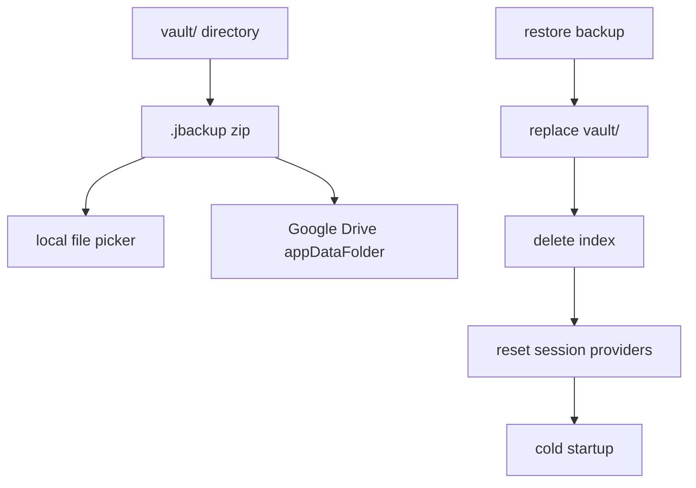
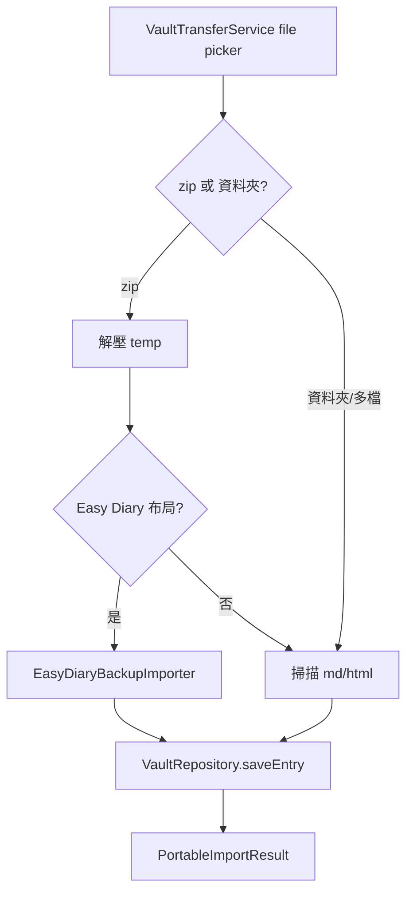

# 備份與還原

本機 `.jbackup`、Google Drive 備份、可攜式 Markdown/HTML/Easy Diary 匯入匯出，以及還原後的 App 重置流程。

## 備份 / 還原管線

## 本機備份

- 將日記庫（`vault/`）封裝為 `.jbackup` zip
- 透過檔案選擇器匯出
- **不含** `index/` 子目錄（索引為衍生資料，還原後重建）
- **含** `vault/tag_styles.json`（標籤自訂顏色；與索引同步）

相關模組：`VaultTransferService`、`VaultArchiveIo`（facade）、`VaultBackupIo`（[`portable/vault_backup_io.dart`](../lib/infrastructure/storage/portable/vault_backup_io.dart)）

## 可攜式匯入／匯出

設定頁的 Markdown／HTML 匯入匯出走可攜格式管線，**不**經 `.jbackup` 還原流程；匯出為解密後可讀內容，匯入則逐篇 `saveEntry` 寫入加密日記庫。

### 匯出

| 格式 | 入口 | 說明 |
|------|------|------|
| Markdown zip | `VaultTransferService.exportMarkdownWithPicker` → `writePortableExportZip` | 解密後 `.md` 與附件，不含 LDJ2 |
| 選取 HTML | `exportSelectedHtmlWithPicker` → `writeSelectedHtmlExport` | 本 App HTML 匯出格式，供再次匯入 |

### 匯入

入口：`VaultTransferService.importDocumentsWithPicker` → `VaultArchiveIo` → `PortableImportIo` 或 `EasyDiaryBackupImporter`。

| 來源 | 辨識 | 備註 |
|------|------|------|
| 本 App Markdown | `.md` + front matter | 遞迴掃描資料夾或 zip 解壓後內容 |
| 本 App HTML | `<article class="… entry …">` | 同 zip 或資料夾流程 |
| Easy Diary 完整備份 zip | `preference.json` + Realm 快照 + `Photos/` | zip 解壓後**優先**嘗試；僅 Android |

Easy Diary 限制：

- 非 Android 平台回 `failureMessage`，提示改用 Android 版 App
- Easy Diary 內**加密日記**略過（計入 `skippedFiles`）
- Realm 版本不相容或讀取失敗時回 `failureMessage`，不部分寫入

匯入結果為 `PortableImportResult`；設定頁依 [`portable_import_result_messages.dart`](../lib/features/settings/portable_import_result_messages.dart) 顯示成功或失敗 SnackBar。匯入後搜尋索引經 `saveEntry` 同步，見 [索引資料庫.md](./索引資料庫.md)。

相關模組：`VaultTransferService`、`PortableImportIo`、`PortableExportIo`、`EasyDiaryBackupImporter`（[`import/easy_diary/`](../lib/infrastructure/storage/import/easy_diary/)）

## Google Drive 備份

- 設定頁會先顯示 Google Drive 是否已連結
- 未連結時，先按「連結 Google Drive」完成 Google 登入與授權
- 已連結後，可直接上傳 temp `.jbackup` 到 `appDataFolder`
- 可列出、下載並還原目前 App 實際可讀取的 `.jbackup` 備份

OAuth 設定見 [Google-Drive-OAuth-設定.md](./Google-Drive-OAuth-設定.md)。

## 還原

### 還原前（`RestoreBackupFlow`）

1. 使用者選擇 `.jbackup`（本機或先從 Google Drive 下載到暫存檔）
2. `precheckRestore` 比對本機 `vault_id` 與本機受信任裝置
3. 確認對話框（覆寫警告、是否需復原金鑰、末四碼提示等）
4. 若需復原金鑰：`verifyBackupRecoveryKey` 驗證通過後才 `restoreFromBackupFile`（失敗不覆寫本機）

### 還原執行（`restoreBackupZip`）

1. 完整解 zip 到 temp，先驗證備份具備安全路徑、`recovery.json`，以及可用的加密內容（`manifest.json.enc` 或至少一份 `.md.enc`）
2. 複製到 `vault.incoming`，再以 rename 替換 `vault/`（失敗時盡量保留原日記庫）
3. 刪除 stray `vault/index/`
4. `deleteDatabaseFiles()` 清除索引
5. `clearRecoveryMetadataCache()` 清除 metadata 快取
6. **同 `vault_id`、同復原金鑰世代（KDF salt 相同）、本機曾有受信任裝置**時：保留 Keystore／secure storage 的 wrapped recovery（`preserveTrustedDeviceAccess`）；其餘情況仍 `clearTrustedDeviceAccess()`

### 還原後（UI）

1. `appSessionProvider.reset()`，invalidate 相關 provider
2. **同裝置受信任還原路徑**（`expectsTrustedUnlockAfterRestore`）：主動呼叫 `unlock(afterRestore: true)`，以生物辨識／螢幕鎖解鎖，不必手動輸入復原金鑰
3. **其餘情況**等同冷啟動，跑 `appStartupProvider`：
   - 有本機受信任且 `vault_id` 相符 → 自動 `unlock()`
   - 否則 → `recoveryRequired`，請輸入**建立該備份時**保存的復原金鑰（設定頁會顯示金鑰末四碼提示）
   - 若曾「更新復原金鑰」，舊備份需**備份當下**的舊金鑰，不是目前這把新金鑰
   - 受信任自動解鎖失敗時，訊息為「還原後無法以本機受信任裝置自動解鎖…」，而非「金鑰不相符」
   - 使用者取消生物驗證 → `locked`；可手動按「重新驗證」，系統 prompt 內可改用裝置螢幕鎖
4. SnackBar 依最終狀態顯示對應訊息（避免與畫面鎖定狀態矛盾）
5. 若已 `unlocked`，重建索引快取並導回首頁

## 操作限制

- 備份與還原按鈕僅在 `unlocked` 且有效 session 時啟用；須透過 `runSensitiveTask` 執行還原本體
- Google Drive 連結可先獨立完成，不必等到解鎖後才登入 Google
- 選擇備份檔與確認對話框可在還原前於未鎖定畫面完成
- 本機／雲端備份還原、Markdown／HTML 匯入／匯出：須已建立復原金鑰且日記庫已解鎖（設定頁按鈕會依此停用）
- 可攜式匯出為解密後 Markdown 或 HTML，不含日記庫 LDJ2 加密格式
- 可攜式匯入不取代 `.jbackup` 還原；大量或完整日記庫遷移仍應使用 `.jbackup`

## 相關文件

- [Google-Drive-OAuth-設定.md](./Google-Drive-OAuth-設定.md) — Drive OAuth 設定
- [解鎖與會話.md](./解鎖與會話.md) — 還原後解鎖路徑
- [索引資料庫.md](./索引資料庫.md) — 還原後索引重建、匯入後 `saveEntry` 同步
- [模組參考.md](./模組參考.md) — storage 子模組與 `PortableImportResult`

---

[← 返回文件目錄](./文件目錄.md)
