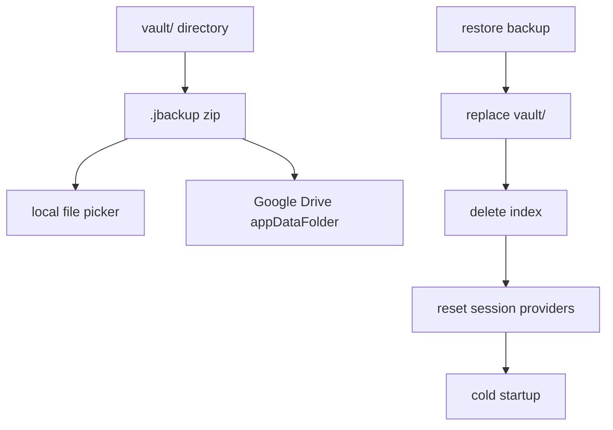

# 備份與還原

本機 `.jbackup` 與 Google Drive 備份、還原後的 App 重置流程。

## 備份 / 還原管線

## 本機備份

- 將日記庫（`vault/`）封裝為 `.jbackup` zip
- 透過檔案選擇器匯出
- **不含** `index/` 子目錄（索引為衍生資料，還原後重建）
- **含** `vault/tag_styles.json`（標籤自訂顏色；與索引同步）

相關模組：`VaultTransferService`、`VaultArchiveIo`

## Google Drive 備份

- 先建立已授權的 Drive API 連線
- 建立 temp `.jbackup` 後上傳至 `appDataFolder`
- 可列出（`name contains '.jbackup'`）、下載並還原

OAuth 設定見 [Google-Drive-OAuth-設定.md](./Google-Drive-OAuth-設定.md)。

## 還原

### 還原前（`RestoreBackupFlow`）

1. 使用者選擇 `.jbackup`（本機或先從 Google Drive 下載到暫存檔）
2. `precheckRestore` 比對本機 `vault_id` 與本機受信任裝置
3. 確認對話框（覆寫警告、是否需復原金鑰、末四碼提示等）
4. 若需復原金鑰：`verifyBackupRecoveryKey` 驗證通過後才 `restoreFromBackupFile`（失敗不覆寫本機）

### 還原執行（`restoreBackupZip`）

1. 完整解 zip 到 temp，驗證至少存在 `recovery.json` 或 `entries/`
2. 複製到 `vault.incoming`，再以 rename 替換 `vault/`（失敗時盡量保留原日記庫）
3. 刪除 stray `vault/index/`
4. `deleteDatabaseFiles()` 清除索引
5. `clearRecoveryMetadataCache()` 清除 metadata 快取
6. **同 `vault_id`、同復原金鑰世代（KDF salt 相同）、本機曾有受信任裝置**時：保留 Keystore／secure storage 的 wrapped recovery（`preserveTrustedDeviceAccess`）；其餘情況仍 `clearTrustedDeviceAccess()`

### 還原後（UI）

1. `appSessionProvider.reset()`，invalidate 相關 provider
2. **同裝置受信任還原路徑**（`expectsTrustedUnlockAfterRestore`）：主動呼叫 `unlock(afterRestore: true)`，以生物辨識／螢幕鎖解鎖，不必手動輸入復原金鑰
3. **其餘情況**等同冷啟動，跑 `appStartupProvider`：
   - 有本機受信任且 `vault_id` 相符 → 自動 `unlock()`
   - 否則 → `recoveryRequired`，請輸入**建立該備份時**保存的復原金鑰（設定頁會顯示金鑰末四碼提示）
   - 若曾「更新復原金鑰」，舊備份需**備份當下**的舊金鑰，不是目前這把新金鑰
   - 受信任自動解鎖失敗時，訊息為「還原後無法以本機受信任裝置自動解鎖…」，而非「金鑰不相符」
   - 使用者取消生物驗證 → `locked`；若為生物模式且已設螢幕鎖 → `deviceCredentialFallback`，可點「使用裝置螢幕鎖」
4. SnackBar 依最終狀態顯示對應訊息（避免與畫面鎖定狀態矛盾）
5. 若已 `unlocked`，重建索引快取並導回首頁

## 操作限制

- 備份與還原按鈕僅在 `unlocked` 且有效 session 時啟用；須透過 `runSensitiveTask` 執行還原本體
- 選擇備份檔與確認對話框可在還原前於未鎖定畫面完成
- 本機／雲端備份還原、Markdown 匯入／匯出：須已建立復原金鑰且日記庫已解鎖（設定頁按鈕會依此停用）
- Markdown 匯出為解密後的 Markdown，不含日記庫加密格式

## 相關文件

- [Google-Drive-OAuth-設定.md](./Google-Drive-OAuth-設定.md) — Drive OAuth 設定
- [解鎖與會話.md](./解鎖與會話.md) — 還原後解鎖路徑
- [索引資料庫.md](./索引資料庫.md) — 還原後索引重建

---

[← 返回文件目錄](./文件目錄.md)
