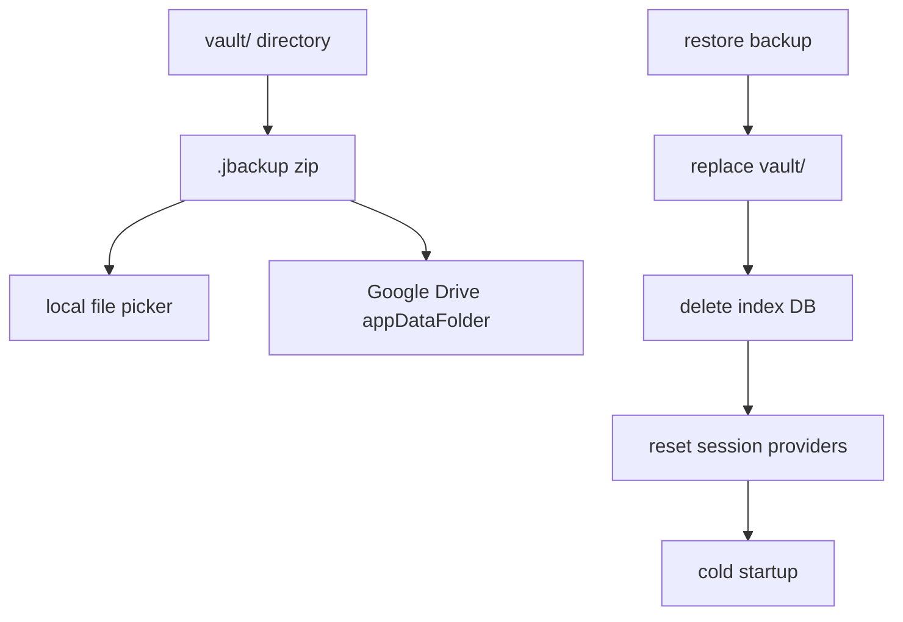

# 備份與還原

本機 `.jbackup` 與 Google Drive 備份、還原後的 App 重置流程。

## 備份 / 還原管線

## 本機備份

- 將 `vault/` 封裝為 `.jbackup` zip
- 透過檔案選擇器匯出
- **不含** `index/` 子目錄（索引為衍生資料，還原後重建）

相關模組：`VaultTransferService`、`VaultArchiveIo`

## Google Drive 備份

- 先建立已授權的 Drive API 連線
- 建立 temp `.jbackup` 後上傳至 `appDataFolder`
- 可列出（`name contains '.jbackup'`）、下載並還原

OAuth 設定見 [Google-Drive-設定.md](./Google-Drive-設定.md)。

## 還原

### 還原前（`RestoreBackupFlow`）

1. 使用者選擇 `.jbackup`（本機或先從 Google Drive 下載到暫存檔）
2. `precheckRestore` 比對本機 `vault_id` 與 trusted device
3. 確認對話框（覆寫警告、是否需復原金鑰、末四碼提示等）
4. 若需復原金鑰：`verifyBackupRecoveryKey` 驗證通過後才 `restoreFromBackupFile`（失敗不覆寫本機）

### 還原執行（`restoreBackupZip`）

1. 完整解 zip 到 temp，驗證至少存在 `recovery.json` 或 `entries/`
2. 複製到 `vault.incoming`，再以 rename 替換 `vault/`（失敗時盡量保留原 `vault/`）
3. 刪除 stray `vault/index/`
4. `deleteDatabaseFiles()` 清除索引
5. `clearRecoveryMetadataCache()` 清除 metadata 快取

### 還原後（UI）

1. `appSessionProvider.reset()`，invalidate 相關 provider
2. 等同**冷啟動**，跑 `appStartupProvider`：
   - 有 trusted 且 `vault_id` 相符 → 顯示「正在以本機受信任裝置解鎖…」並自動 `unlock()`
   - 否則 → `recoveryRequired`，請輸入**建立該備份時**保存的復原金鑰
   - 使用者取消生物驗證 → `locked`；若為生物模式且已設螢幕鎖 → `deviceCredentialFallback`，可點「使用裝置螢幕鎖」
3. SnackBar 依最終狀態顯示對應訊息（避免與畫面鎖定狀態矛盾）
4. 若已 `unlocked`，重建索引快取並導回首頁

## 操作限制

- 備份與還原按鈕僅在 `unlocked` 且有效 session 時啟用；須透過 `runSensitiveTask` 執行還原本體
- 選擇備份檔與確認對話框可在還原前於未鎖定畫面完成
- Markdown 匯出同樣僅在解鎖 session 有效時允許；匯出為解密後的 Markdown，不含 vault 加密格式
