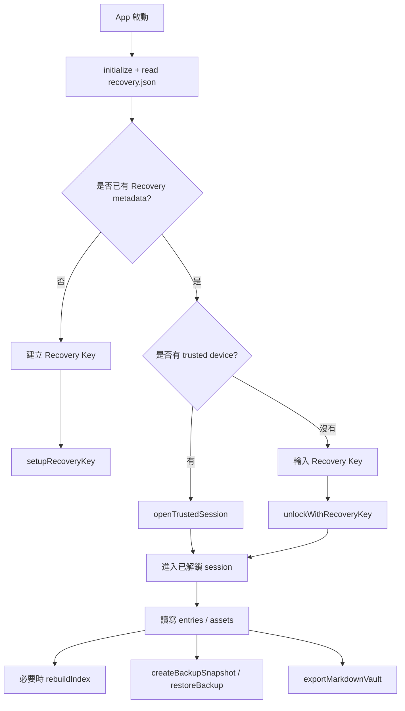

# 其他主要流程

與「單檔 encrypt/decrypt」相鄰的流程：vault 生命周期、索引、備份與離開 vault 的匯出。實作主檔：`lib/infrastructure/storage/vault_repository.dart`。

## 全域流程圖



## 1. 目錄與檔案位置慣例

根目錄：`ApplicationSupportDirectory/quill_lock_diary/`（詳見 `VaultPathStrategy`）。

| 路徑 | 角色 |
|------|------|
| `vault/recovery.json` | Recovery／KDF／vault id／hint |
| `vault/manifest.json.enc` | 加密摘要 Manifest；並用來**驗證** Recovery Key |
| `vault/entries/.../*.md.enc` | 加密日記 |
| `vault/assets/.../*.enc` | 加密附件 |
| `vault/index/journal_index.sqlite` | Drift SQLite 索引（可重建） |
| `backups/*.jbackup` | 本地 zip 備份快照 |
| `exports/...` | 明文 Markdown 匯出目的資料夾 |

## 2. 首次建立：Recovery Key 與受信任裝置

```
setupRecoveryKey():
  ├─ 檢查尚無 recovery.json
  ├─ 產生 Recovery Key（隨機高熵字串，僅顯示給使用者備份）
  ├─ 建立 KdfDescriptor（Argon2id salt 等）
  ├─ deriveRecoveryWrapKey → recoveryWrapKey
  ├─ 寫入 recovery.json（不含完整 Recovery Key）
  ├─ ensureDeviceKey（Keystore／槽資訊）
  ├─ storeWrappedRecoveryKey（用裝置金鑰把 recoveryWrapKey 再包一層，供日後 openTrustedSession）
  └─ 寫加密 manifest.json.enc → 回傳 session + 將 Recovery Key 顯示在 UI（一次）
```

此時「當前裝置」已註冊為可用 **受信任捷徑** 解鎖者。

## 3. 受信任 Session：`openTrustedSession`

```
read recovery.json
若 !hasTrustedKey → 要求 Recovery 流程
unwrapWithDeviceKey(包在 secure storage 的 wrapped recoveryWrapKey)
_verifyRecoveryKey(metadata, recoveryWrapKey)  // manifest 可被 decrypt
建立 UnlockedVaultSession(trustedDevice: true, recoveryWrapKey present, deviceSlotId)
_resumeRewrapIfNeeded  // 先前若中斷 rewrap，於此繼續
```

unwrap 若失敗：清掉無效 trust 並提示改用 Recovery Key。

## 4. Recovery Key 重新解鎖：`unlockWithRecoveryKey`

適用：**換機、Keystore 重置、trusted 資料毀損**。

```
deriveRecoveryWrapKey(recoveryKey, metadata.kdf)
_verifyRecoveryKey(metadata, derived)
ensureDeviceKey + storeWrappedRecoveryKey（重新綁裝置）
標記 _rewrapInProgress → _rewrapVaultForTrustedDevice(...) → 清除進行中標記
rebuildIndex(session)
```

核心：**對 vault 內現有每一份 LDJ2**（entries、assets、manifest 等會掃到的檔案）解密後，再以**新的裝置槽**與現有 recoveryWrapKey **重新 encrypt**，讓日常使用回到裝置槽。

若在 rewrap 當機，下次開 trusted session 會依 flag **續跑**未完成部分。

## 5. 寫入日記：`saveEntry`

1. 處理待上傳附件 → 每一份附件走與正文相同的 **encryptBytes** pipeline。
2. `DiaryEntry` → front matter Markdown 字串。
3. `encryptMarkdown`（帶 recoveryWrapKey + metadata.kdf）→ `.md.enc` 原子寫入。
4. 更新 SQLite 條目、附件、全文搜尋文件。
5. 更新 **`manifest.json.enc`**。

索引永遠在加密檔寫入成功之後更新，以降低「索引指到破檔」的機率。

## 6. 索引重建：`rebuildIndex`

1. Drift：`rebuild()` 清空並重建結構。
2. 遍歷 `vault/entries/**/*.md.enc`，逐檔 parse + decrypt → 回填索引與附件關聯。

前提：必須已具備可用 **DecryptContext**（session）。因此「只有檔案、沒有鑰匙」無法線上重建索引。

## 7. 本地備份：`createBackupSnapshot`

- Zip **整個** `vault/` 目錄為 `backupId.jbackup`（不包含 exports）。
- **皆為加密內容**；備份不包含完整 Recovery Key 字串。
- 還原仍須：**同一套 recovery.json + 原本的 Recovery Key 或仍有效的裝置 trust**。

## 8. 還原備份：`restoreBackup`

1. Zip 驗證 `verify: true`，解至暫存目錄並檢查路徑安全。
2. 刪除既有 `vault/`，將暫存內容搬入。
3. 清除 Recovery metadata cache、重置本地 SQLite 索引狀態（後續由 App 再以 Recovery / trusted session 決定下一步）。

Google Drive：**下載最新 `.jbackup` → 同上 `restoreBackup`**。

## 9. 明文匯出：`exportMarkdownVault`

在 **已解密 session** 下：

- 對每則未被軟刪除的 entry：`loadEntry`（decrypt）。
- `entries/` 下寫出 **明文 `.md`**（檔名帶日期等）。
- 附件：**decrypt** 後複製到 exports 底下的 `assets/...`，檔名用 `safeFilename`。

此為離開 vault 的**有意明文洩出路徑**，僅在有 session 時執行。

## 10. Manifest 的角色（補述）

加密 JSON 粗略包含：vault id、entry 統計與日期範圍、app_version 字串等。用途包括：

- 使用 Recovery Key 時做 **試解密驗證**；
- 提供使用者面向的 vault 概要（需在 session 下讀）。

---

**相關**：[加密流程.md](./加密流程.md) · [解密流程.md](./解密流程.md)
