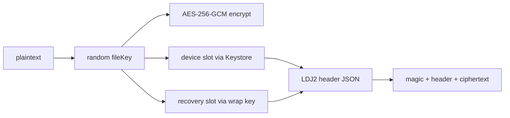

# 加密格式

這份文件整理 Quill Diary 目前使用的 `LDJ2` 加密格式，包括檔案結構、寫入方式、key slot 與解密邏輯。

它只說明加密資料本身，不重講 UI 解鎖流程。

## 這個格式在做什麼

`LDJ2` 用來保護日記、附件與其他需要加密保存的內容。

它的核心做法是：

- 每個加密檔案都有自己的隨機 `fileKey`
- 正文用 `AES-256-GCM` 加密
- 同一把 `fileKey` 會再分別包進不同的 key slot
- 目前主要有兩種 slot：`device` 與 `recovery`

這代表同一份內容可以依當前解鎖情境，用可信裝置或復原金鑰路徑打開。

## 檔案結構

每個加密檔案的格式如下：

```text
[magic "LDJ2" 4B][header length uint32 BE][JSON header][AES-GCM ciphertext + tag]
```

重點：

- magic 固定為 `LDJ2`
- header 使用 JSON
- `schema_version` 目前為 `1`
- 內容加密演算法是 `aes-256-gcm`
- AAD 使用整段 canonical header bytes

最後一點很重要。因為 header 本身會參與驗證，所以如果有人竄改 header，正文驗證也應該失敗。

## 寫入流程



實際寫入時的順序：

1. 產生隨機 `fileKey`
2. 用 `fileKey` 對正文做 `AES-256-GCM` 加密
3. 建立對應的 key slot
4. 組出 header
5. 寫成 `magic + header length + header + ciphertext`

## Key Slot

`LDJ2` 不直接把解密能力綁死在單一路徑，而是把 `fileKey` 包成不同 slot。

| Slot | 用途 | 備註 |
|------|------|------|
| `device` | 讓可信裝置 session 解開內容 | 使用 Android Keystore 包裝 `fileKey` |
| `recovery` | 讓復原金鑰路徑解開內容 | 使用 recovery wrapping key 包裝 `fileKey`，並保留 KDF 資訊 |

### Device Slot

- 走可信裝置解鎖路徑
- 由 Android Keystore 保護
- 可能對應 `deviceCredential` 或 `biometric` 類型的裝置保護能力

### Recovery Slot

- 走復原金鑰解鎖路徑
- slot 內會帶出對應的 `kdf` 描述
- 讓同一份加密內容不依賴單一裝置才能解開

## Recovery wrapping key

使用者輸入的復原金鑰不會直接拿來解正文。

它會先經過 **Argon2id**，再得到 recovery wrapping key。相關參數記錄在 `recovery.json`。

這把 key 的用途不只一個：

- 包裝或解開 `recovery` slot 內的 `fileKey`
- 包裝可信裝置使用的 wrapped recovery key
- 衍生搜尋索引資料庫使用的金鑰

## 解密邏輯

`decryptBytes` 會依 `DecryptionContext` 決定優先使用哪條路徑。

### 優先序

1. 若 `trustedDevice == true`，先依 `deviceSlotId` 尋找 `device` slot，並透過 Keystore unwrap
2. 否則若目前有 `recoveryWrapKey`，改走 `recovery` slot
3. 若都失敗，則回傳驗證失敗

### 這代表什麼

- 可信裝置 session 會優先走裝置路徑
- 沒有可信裝置條件時，仍可用復原金鑰路徑解開
- slot 找不到、unwrap 失敗或 header / 正文被破壞時，整個解密應該失敗

## Manifest 的角色

`vault/manifest.json.enc` 是復原金鑰驗證時的首選目標。

原因很簡單：它是穩定、固定存在的加密資料之一，適合用來先確認目前的復原金鑰是否能正確打開這個 vault。

若 manifest 不存在，程式才會 fallback 掃描其他可驗證的 `.enc` 檔案。

## 與其他文件的邊界

- 這份文件只講加密資料結構與解密路徑
- 解鎖畫面、timeout、resume 與 session 狀態，請看 [解鎖與會話.md](./解鎖與會話.md)
- 搜尋索引金鑰如何衍生與何時開關，請看 [索引資料庫.md](./索引資料庫.md)
- 備份封裝哪些加密資料，請看 [備份與還原.md](./備份與還原.md)

---

[← 返回文件目錄](./文件目錄.md)
