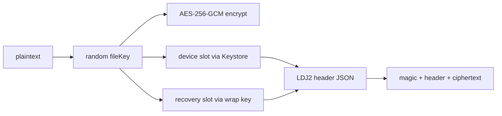

# 加密格式

日記與附件的 `LDJ2` 加密格式：寫入、key slot 與解密優先序。

## 寫入流程



## 檔案格式

```
[magic "LDJ2" 4B][header length uint32 BE][JSON header][AES-GCM ciphertext + tag]
```

- `schema_version: 2`，內容 cipher：`aes-256-gcm`
- **AAD** = 整段 canonical header bytes；header 被竄改時正文驗證必須失敗

## 寫入步驟

1. 產生隨機 `fileKey`
2. 用 `fileKey` 對正文做 `AES-256-GCM` 加密
3. 建立兩種 key slot：
   - **device**：Android Keystore 包裝 `fileKey`（`wrap_algorithm: android-keystore-aes-gcm`）
   - **recovery**：recovery wrapping key 包裝 `fileKey`（含 `kdf` 描述）
4. 組出 header，寫入 `magic + header length + header + ciphertext`

## Key Slot

| Slot | 用途 | 備註 |
|------|------|------|
| device | trusted device session 解開 | 標示 `plain` 或 `auth` |
| recovery | Recovery Key 解開 | KDF 參數寫在 slot 內 |

## Recovery wrapping key

使用者 Recovery Key → **Argon2id**（參數存於 `recovery.json`）→ recovery wrapping key。

此 key 也用於：包裝 trusted device 的 wrapped recovery key、索引 DB 金鑰衍生。

## 解密優先序

`decryptBytes` 依 `DecryptionContext` 決定：

1. `trustedDevice == true`：依 `deviceSlotId` 找 device slot → Keystore unwrap → 解密正文
2. 否則若有 `recoveryWrapKey`：用 recovery slot unwrap
3. 失敗 → `SecretBoxAuthenticationError`

## Manifest

- `vault/manifest.json.enc` 是 Recovery Key 驗證的**首選**目標
- manifest 不存在時，fallback 掃描其他可驗證的 `.enc` 檔
