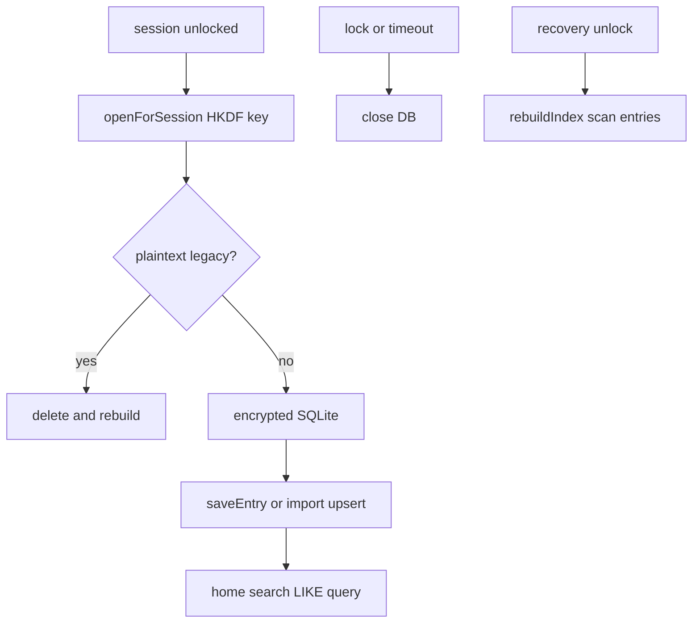

# 索引資料庫

解鎖 session 期間的 SQLite 索引：開啟、同步、搜尋、關閉與重建。

## 生命週期

## 路徑與加密

- 路徑：`{appSupport}/quill_diary/index/journal_index.sqlite`
- 與日記庫 **分開存放**
- 金鑰：以 recovery wrapping key + vaultId 經 HKDF 衍生 SQLCipher key

## 開啟（`openForSession`）

1. 若已開且同 vaultId → 重用
2. 否則 `close()` → 偵測 legacy plaintext header → 若有則刪除重建
3. HKDF 衍生 key → 開啟加密 SQLite → `initialize()`

## 與 Session 綁定

| 時機 | 動作 |
|------|------|
| 本機受信任 / 復原金鑰解鎖 | `_openIndexForSession` |
| 解鎖後首次使用 | `ensureIndexReady`：無 `last_rebuild_at` 時 `rebuildIndex` |
| 復原金鑰解鎖完成 | 強制 `rebuildIndex` |
| rewrap 續跑完成 | `rebuildIndex` |
| lock / reset / timeout | `closeUnlockedResources` → `close()` |
| 備份還原 | `deleteDatabaseFiles()` |

## 首頁搜尋模型

- 首頁搜尋只走單一路徑 `LIKE %query%`
- query、標題、內文、tag 都先經過同一套 `normalizeSearchText()`
- 搜尋命中來源固定為：
  - `entries_index.title_search_text`
  - `entries_index.body_search_text`
  - `entry_tags.tag_normalized`
- `preview_text` 只供列表摘要顯示，不參與搜尋語意
- 搜尋不依賴 FTS，也不再區分 primary / fallback 路徑

## 搜尋欄位

`entries_index` 內與首頁搜尋直接相關的欄位：

| 欄位 | 用途 |
|------|------|
| `title` | 原始標題，供 UI 顯示 |
| `title_search_text` | 標題搜尋字串，經統一正規化 |
| `preview_text` | 列表摘要文字，不參與搜尋 |
| `body_search_text` | 完整內文搜尋字串，經 markdown 清理與統一正規化 |
| `char_count` | 內文 Unicode 字元數（`markdownBody.runes.length`），供首頁列表與編輯器字數 pill 顯示 |

`entry_tags.tag_normalized` 則作為標籤搜尋來源。

## rebuildIndex

1. 清空索引表
2. 遞迴掃描 `vault/entries/**/*.md.enc`
3. 解密並還原 `DiaryEntry`
4. 重算 `preview_text`、`title_search_text`、`body_search_text`、`entry_tags`
5. 寫回 attachments 索引
6. 寫入 app 值 `last_rebuild_at` 與 `search_schema_version`

## 執行期寫入

`saveEntry`、`deleteEntry` 等操作透過 `_requireOpenIndex()`，須 session 已開啟索引。

- 新增日記：寫入加密檔後，立即同步寫搜尋欄位
- 編輯日記：覆蓋同一筆搜尋欄位與標籤索引，讓舊內容立即失效；若移除附件或變更日期，會同步刪除或搬移磁碟上的 `.enc` 檔，避免孤兒檔
- **`deleteEntry`（硬刪除）**：刪除 `vault/entries` 的 `.md.enc`、相關 `vault/assets` 的 `.enc`、索引列（`removeEntry`），並更新 manifest；刪除後無法復原
- 匯入日記：最終也走 `saveEntry()`，因此不需要額外補建搜尋資料
- `ensureIndexReady()` 會檢查 `search_schema_version`；版本落後時直接重建

## 標籤目錄與樣式

- SQLite `tag_styles` 表為執行期快取，供首頁與編輯器顯示標籤 accent 顏色
- 權威來源為 `vault/tag_styles.json`（`TagStylesStore`），以 `tags` 陣列保存完整標籤目錄（含未使用標籤）
- 使用者新增或編輯標籤時同步寫入 json；有設定 accent 者亦寫入索引表
- 備份還原會刪除索引並重建；目錄與顏色由 json 重新載入（`.jbackup` 含 `tag_styles.json`）

## Rewrap 旗標

復原金鑰解鎖後重包所有 `.enc` 的 device slot 期間：

- `rewrap_in_progress` / `rewrap_started_at` 存於日記庫內 app 表
- 本機受信任啟動時可 `_resumeRewrapIfNeeded` 續跑未完成 rewrap

## 相關文件

- [加密格式.md](./加密格式.md) — recovery wrapping key 與 HKDF
- [架構.md](./架構.md) — 日記庫儲存結構
- [備份與還原.md](./備份與還原.md) — 還原後索引刪除重建

---

[← 返回文件目錄](./文件目錄.md)
