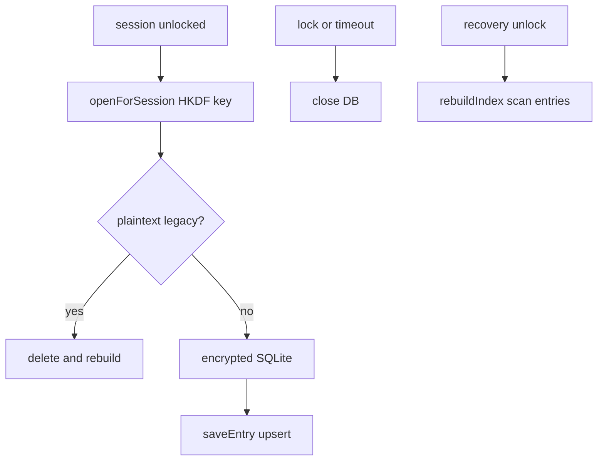

# 索引資料庫

解鎖 session 期間的 SQLite 索引：開啟、同步、關閉與重建。

## 生命週期

## 路徑與加密

- 路徑：`{appSupport}/quill_lock_diary/index/journal_index.sqlite`
- 與 vault **分開存放**
- 金鑰：以 recovery wrapping key + vaultId 經 HKDF 衍生 SQLCipher key

## 開啟（`openForSession`）

1. 若已開且同 vaultId → 重用
2. 否則 `close()` → 偵測 legacy plaintext header → 若有則刪除重建
3. HKDF 衍生 key → 開啟加密 SQLite → `initialize()`

## 與 Session 綁定

| 時機 | 動作 |
|------|------|
| trusted / recovery 解鎖 | `_openIndexForSession` |
| 解鎖後首次使用 | `ensureIndexReady`：無 `last_rebuild_at` 時 `rebuildIndex` |
| recovery 解鎖完成 | 強制 `rebuildIndex` |
| rewrap 續跑完成 | `rebuildIndex` |
| lock / reset / timeout | `closeUnlockedResources` → `close()` |
| 備份還原 | `deleteDatabaseFiles()` |

## rebuildIndex

1. 清空索引表
2. 遞迴掃描 `vault/entries/**/*.md.enc`
3. 解密後 `upsertEntry`（含 search、attachments）
4. 寫入 app 值 `last_rebuild_at`

## 執行期寫入

`saveEntry`、`deleteEntry` 等操作透過 `_requireOpenIndex()`，須 session 已開啟索引。

## Rewrap 旗標

Recovery 解鎖後重包所有 `.enc` 的 device slot 期間：

- `rewrap_in_progress` / `rewrap_started_at` 存於 vault 內 app 表
- trusted 啟動時可 `_resumeRewrapIfNeeded` 續跑未完成 rewrap
