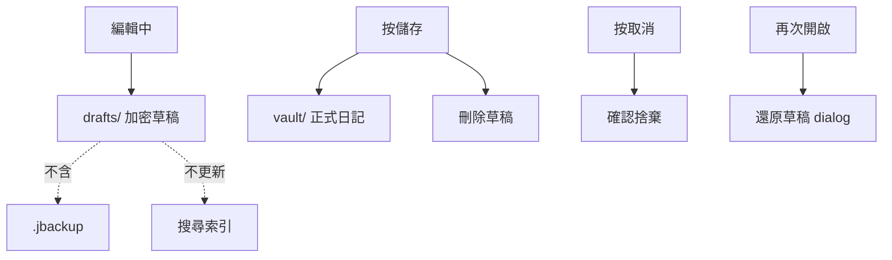

# 編輯器草稿

編輯器在正式寫入日記庫前，會將未完成內容以加密草稿保存在本機 `drafts/` 目錄。

## 行為摘要

| 時機 | 行為 |
|------|------|
| 編輯中 | 欄位變更後**即時**寫入本地加密草稿；**不要求標題** |
| 手動儲存 | 須輸入標題；寫入 `vault/` 日記庫後**刪除草稿**與暫存附件 |
| 取消編輯 | 相對日記庫內容無變更則靜默捨棄草稿；有變更則確認後捨棄 |
| 再次開啟 | 若該篇有草稿，顯示還原對話框；還原後**進入編輯模式** |

新建日記的 `draftKey` 為 `__new__`；儲存成功後路由改為正式 `entryId`。既有日記則以 `entryId` 為 `draftKey`。

## 儲存路徑

草稿與日記庫、索引同屬 App 根目錄（`getApplicationSupportDirectory()` 下的應用儲存目錄），**不在** `vault/` 內：

| 路徑 | 內容 |
|------|------|
| `drafts/{draftKey}/draft.json.enc` | 加密草稿 JSON（標題、日期、標籤、內文、附件 id、pending 描述） |
| `drafts/{draftKey}/pending/` | 選檔後複製的待上傳附件；寫入草稿時 prune 不再引用的檔案 |

路徑策略見 [`vault_path_strategy.dart`](../lib/infrastructure/storage/vault_path_strategy.dart)。

## 加密

- 格式與日記庫相同：**LDJ2**（`CryptoService.encryptBytes`）
- 解密須目前解鎖 session 的 `recoveryWrapKey` 與 `vaultId`
- `documentId` 為 `draft_{draftKey}`

鎖定 session 或 vault 未解鎖時，無法讀寫草稿。

## UI 訊號

- 首頁列表與編輯器**檢視模式**在字數 tag 前顯示紅色「**未儲存**」tag
- 資料來源：`editorDraftKeysProvider`（掃描 `drafts/` 下仍有 `draft.json.enc` 的 key）
- 編輯模式不顯示此 tag（避免與正在編輯的畫面重複）

## 邊界

| 項目 | 說明 |
|------|------|
| 搜尋索引 | 草稿不更新索引；僅 `VaultRepository.saveEntry` 後同步 |
| 完整備份 | `.jbackup` 只封裝 `vault/`，**不含** `drafts/` |
| 還原 | 還原取代 `vault/` 並重建索引；不主動刪除既有 `drafts/` |
| 空白新建 | 無標題、無內文、無附件的 `__new__` 草稿會被自動捨棄 |

## 相關程式

| 元件 | 檔案 |
|------|------|
| 持久化 | [`editor_draft_store.dart`](../lib/infrastructure/storage/editor_draft_store.dart) |
| 模型與 dirty 比對 | [`editor_draft.dart`](../lib/features/editor/editor_draft.dart) |
| 編輯流程 | [`editor_page.dart`](../lib/features/editor/pages/editor_page.dart) |
| 草稿 key 索引 | [`editor_draft_providers.dart`](../lib/features/editor/providers/editor_draft_providers.dart) |

## 相關文件

- [架構.md](./架構.md) — 儲存結構與 Editor 模組
- [模組參考.md](./模組參考.md) — `EditorDraftStore` 與 Provider 速查
- [索引資料庫.md](./索引資料庫.md) — 何時更新搜尋索引
- [備份與還原.md](./備份與還原.md) — 備份範圍

---

[← 返回文件目錄](./文件目錄.md)
