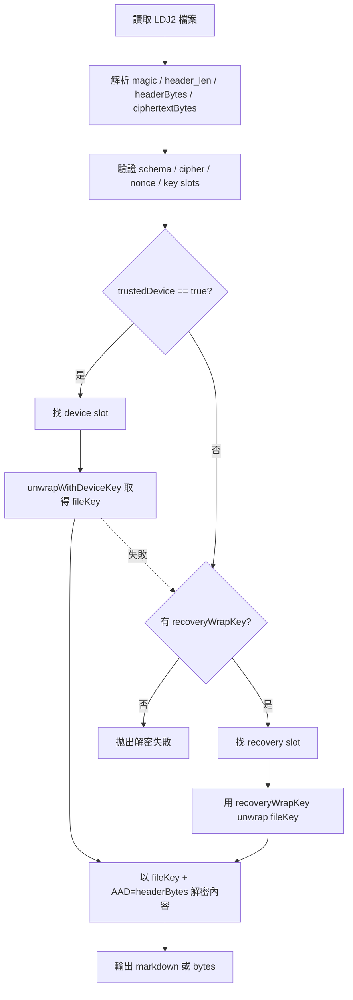

# 解密流程（LDJ2）

說明從 `.md.enc` / `*.enc` 還原明文的邏輯，以及程式**先嘗試哪一條金鑰路徑**。實作：`LocalCryptoService.decryptBytes` / `decryptMarkdown`。

## 流程圖

## 1. 進入解密的前置：`UnlockedVaultSession`

要 decrypt 任一檔案，應用層會帶：

- **vaultId**（必須與標頭一致）
- **trustedDevice**：是否可走裝置槽。
- **recoveryWrapKey**：32 bytes wrapping key（由 Recovery Key + `recovery.json` 內 Argon2id 導出），裝置與 Recovery 流程在建立 session 時都會盡可能讓這欄非空。
- **deviceSlotId**：受信任機制下要匹配的裝置槽識別（可縮小到單一 slot）。

`DecryptionContext` 只是把以上打包給 crypto 層。

## 2. 解析檔案

1. 讀取全文位元組，檢查 `LDJ2` magic。
2. 讀取 4-byte big-endian header 長度，切出 `headerBytes` 與餘下的 `ciphertextBytes`。
3. `jsonDecode(utf8)` 為 `EncryptedDocumentHeader`，並做 schema / cipher / nonce 長度 / 槽種類等**嚴格驗證**。

## 3. 從 ciphertextBytes 組出 SecretBox

- 標頭里的 `nonce`（Base64）為 **內容** AES-GCM 的 nonce（12 bytes）。
- `ciphertextBytes` 末尾 16 bytes 為 **MAC**（tag），前半為 ciphertext。

解密內容時：**key = fileKey**，**AAD = headerBytes**（與加密時一致）。

## 4. 取得 fileKey：兩條路嘗試順序

### 步驟 A：受信任裝置（優先）

當 **`context.trustedDevice == true`** 時：

1. 在標頭 `key_slots` 中找出 `slot_type == device`，若有 `deviceSlotId` 則必須 id 相符。
2. 呼叫 **`DeviceKeyManager.unwrapWithDeviceKey`**，傳入該槽的 nonce / ciphertext。
3. 若成功 unwrap 得到 `fileKey`，立刻用於 AES-GCM decrypt 並回傳明文。
4. 若 unwrap **拋錯**，實作會 **吞掉例外並繼續**（不重擲），改成嘗試下一步。

這讓 Keystore 暫時失敗或未對齊的槽時，仍可落到 Recovery 槽。

### 步驟 B：Recovery 槽

當 **`context.recoveryWrapKey != null`** 時：

1. 找出 `slot_type == recovery` 的槽。
2. 該槽的 `wrapped_key` + `nonce` 本身也是一包 AES-GCM（**不包含 AAD**，與 encrypt 時 `_unwrapRecoveryKey` 對齊）。
3. 密鑰為 **recoveryWrapKey**，解密結果為 **fileKey**。
4. 用此 fileKey 與標頭 nonce、AAD=headerBytes 解密正文。

若兩路徑皆無法還原，最後拋出驗證失敗類錯誤。

## 5. 「只有 Recovery Key 字串、尚未有 session」的驗證

使用者輸入 Recovery Key 時，不能只靠字串長度判定正確與否。Repository 會在解鎖流程中對 **`manifest.json.enc`**：

- `DecryptionContext.recovery(recoveryWrapKey: …, vaultId: …)` — **不包含** trusted device，`trustedDevice: false`。
- 對 Manifest 跑一次 **recovery 槽**，能成功 unwrap 並 decrypt 即視為 Recovery Key **與此 vault metadata 相符**。

之後才把 **recoveryWrapKey** 存入由裝置金鑰保護的 wrapped record，並可進行 vault 級 **rewrap**（見〈其他主要流程〉）。

## 6. Markdown 與附件

- **日記**：`decryptMarkdown` = `decryptBytes` + UTF-8 decode，再由 front matter codec 解析成 `DiaryEntry`。
- **附件**：`decryptBytes` 得到原始 bytes（如圖片），供縮圖或匯出複製。

---

**延伸**：[其他主要流程.md](./其他主要流程.md)（Session、rewrap、索引、備份、匯出）
