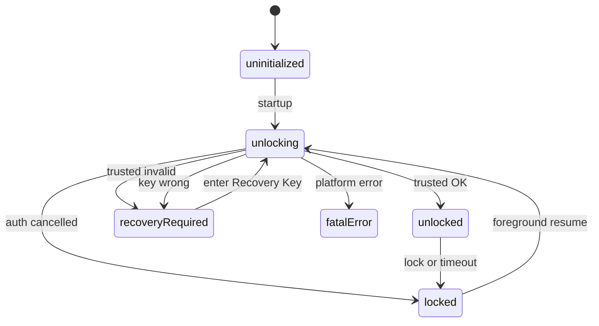
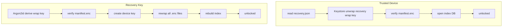

# 解鎖與 Session

App 啟動、解鎖、鎖定與背景恢復的完整流程。

## App 狀態機

`AppLockStatus` 定義於 `lib/features/session/state/app_session_state.dart`：

| 狀態 | 意義 |
|------|------|
| `uninitialized` | 尚未完成啟動初始化 |
| `unlocking` | 正在嘗試 trusted 或 Recovery 解鎖 |
| `unlocked` | vault 已解鎖，可讀寫日記 |
| `locked` | session 失效，trusted 資料仍保留 |
| `recoveryRequired` | 需輸入 Recovery Key |
| `fatalError` | 不可恢復錯誤（例如非 Android 平台） |

## 解鎖序列

## 啟動流程

`appStartupProvider` 依序判斷：

1. 非 Android → `fatalError`
2. `VaultRepository.initialize()` 建立目錄、快取 `recovery.json`
3. **無 Recovery metadata** → `unlocked`（首次使用，需在設定頁建立 Recovery Key）
4. **有 metadata、無 trusted device** → `recoveryRequired`
5. **有 trusted device** → 呼叫 `unlock()` 走 trusted 路徑

## Trusted device 解鎖

1. 讀取 `vault/recovery.json`
2. 確認裝置存在 trusted key（`DeviceKeyManager.hasTrustedKey`）
3. 讀取 wrapped recovery key 與 trusted device info，slot id 必須一致
4. 用 device slot 解出 recovery wrapping key
5. 驗證 `manifest.json.enc`（不存在時 fallback 到其他 `.enc`）
6. 建立 `UnlockedVaultSession`，開啟 index database
7. 若有 `rewrap_in_progress` 旗標，續跑 rewrap

### Trusted 失效 → `recoveryRequired`

| 條件 | 處理 |
|------|------|
| 舊版 slot id | 清除 trusted access |
| slot / device info 不一致 | 清除 trusted access |
| wrapped recovery key 缺失 | 清除 trusted access |
| keystore key 失效 | 清除 trusted access |
| unwrap 失敗 | 清除 trusted access |

不做舊版相容遷移。

### 取消驗證 → `locked`

使用者取消或驗證失敗（`DeviceKeyUserCancelledException` / `DeviceKeyAuthFailedException`）：

- 狀態停在 `locked`
- **不清除** trusted device access

## Recovery Key 解鎖

1. 使用者輸入 Recovery Key
2. 依 `recovery.json` 的 Argon2id 參數導出 recovery wrapping key
3. 驗證 manifest 或 fallback 檔案
4. 建立 device key（依生物辨識設定決定是否需 user auth）
5. 開啟 index，設定 `rewrap_in_progress`，重包所有 `.enc` 的 device slot
6. 儲存 wrapped recovery key，重建 index
7. 清除 rewrap 旗標 → `unlocked`

UI 入口：`SettingsPage` 在 `recoveryRequired` 時顯示 Recovery Key 輸入。

## 首次建立 Recovery Key

`setupRecoveryKey` 流程：

1. 產生 vaultId 與 Recovery Key
2. 寫入 `recovery.json`、建立 device key、wrap recovery key
3. 開啟 index、寫入 `manifest.json.enc`
4. `activateSession` → `unlocked`

## Session Timeout

- App 進入背景後記錄離開前景時間
- 超過 timeout（預設 5 分鐘）回到前景時，使當前 session 失效 → `locked`
- 若 trusted device 可用，自動再跑 `unlock()` 還原
- 若 trusted state 失效 → `recoveryRequired`

敏感操作（備份、還原等）須在 `unlocked` 狀態下透過 `runSensitiveTask` 執行。

## 還原後的鎖定狀態

| 狀態 | 意義 | 使用者操作 |
|------|------|------------|
| `unlocking` | 正以本機受信任裝置解鎖 | 等待；首頁顯示進行中訊息 |
| `locked` | 生物驗證取消或失敗，trusted 仍保留 | 首頁／設定可「重新驗證」，**不必**輸入復原金鑰 |
| `recoveryRequired` | 無 trusted 或與還原後 vault 不符 | 設定頁輸入**建立該備份時**保存的復原金鑰 |

詳見 [備份與還原.md](./備份與還原.md)。
