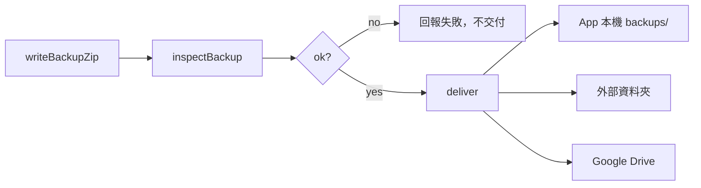

# 備份與還原

這份文件整理 Quill Diary 目前的完整備份、還原、可攜式匯入匯出，以及它們和 session、草稿、索引的邊界。

它描述的是目前程式實際怎麼運作，不把 Google Drive OAuth 細節當主線；Google 帳號連結與 OAuth 設定請看專門文件。

## 先講結論

- Quill Diary 有兩條完全不同的資料轉移路線：
  - **完整備份**：封裝整個加密 `vault/`，用途是之後完整還原
  - **可攜式匯入匯出**：處理 Markdown / HTML / 第三方備份匯入，或把日記輸出成可閱讀格式
- `backup_*.zip` 和 `markdown_*.zip` 雖然都叫 zip，但不是同一種東西，也不能混用。
- 完整備份不包含 `drafts/`、不包含索引資料庫，只包含正式日記庫資料。
- 還原時會覆寫 `vault/`、刪掉索引資料庫、清空本地草稿與暫時解密附件，再依情境重建 session。
- Google Drive 備份與還原不是獨立格式；它只是同一份完整備份 zip 的另一種交付位置。

## 這份文件涵蓋哪些流程

| 類別 | 主要用途 | 代表產物 |
|------|----------|----------|
| 完整備份 | 保存整個加密日記庫，供完整還原 | `backup_YYYY-MM-DD_HH-MM-SS.zip` |
| 可攜式 Markdown 匯出 | 把日記攜出閱讀、整理、散檔再匯入 | `markdown_YYYY-MM-DD_HH-MM-SS.zip` |
| 可攜式 HTML 匯出 | 匯出選取日記或回顧結果成單一 HTML | `html_YYYY-MM-DD_HH-MM-SS.html` |
| 可攜式匯入 | 從 `.md`、`.html`、`.htm`、zip 或 Easy Diary 匯入內容 | 無固定單一產物 |

## 前置條件與權限邊界

設定頁的資料轉移操作不是全部共用同一組條件，而是依 `VaultTransferCapabilities` 與當下 session 狀態決定。

### 需要已解鎖且已有 recovery key

- 建立本機完整備份
- 匯出完整備份到外部資料夾
- 上傳完整備份到 Google Drive

原因：

- `VaultTransferCapabilities.canBackup` 的條件是 `hasUnlockedSession && hasRecoveryKey`

### 需要已解鎖 session，但不要求另外先走完整備份條件

- 可攜式匯出 Markdown
- 可攜式匯出 HTML
- 可攜式匯入文件

這些操作走 `runSensitiveTask(...)`，需要可用的 `UnlockedVaultSession` 才能讀寫正式日記資料。

### 在特定情況下可於未解鎖狀態進入還原流程

- 從本機完整備份還原
- 從外部 `backup_*.zip` 還原
- 從 Google Drive 備份下載後還原

目前規則：

- 若目前有有效解鎖 session，當然可以還原
- 若目前**沒有** recovery key，也可進入還原
- 若目前 lock status 已是 `recoveryRequired`，也可進入還原

也就是說，`canRestore` 並不是簡單等於「一定要已解鎖」。

### Google Drive 帳號管理

- 連結 Google Drive
- 切換帳號
- 解除連結

這些不是完整備份格式的一部分，而是 Drive 帳號連線管理；目前 UI 仍要求有效解鎖 session 才能操作。

## 完整備份

完整備份會把目前 `vault/` 底下的正式資料封裝成一個 `backup_*.zip`。

### 備份內容與不包含的東西

完整備份**包含**：

- `recovery.json`
- `manifest.json.enc`
- `entries/`
- `assets/`
- `tag_styles.json`
- `pinned_entries.json`

完整備份**不包含**：

- `drafts/`
- 搜尋索引資料庫
- `app_preferences.json`

原因：

- `drafts/` 是編輯中的暫存區，不屬於正式日記庫
- 索引是衍生資料，還原後重建即可
- `app_preferences.json` 是 App 本機偏好，不屬於 vault

### 檔名與內部結構

- 檔名：`backup_YYYY-MM-DD_HH-MM-SS.zip`

```text
backup_*.zip
├── recovery.json
├── manifest.json.enc
├── entries/
├── assets/
├── tag_styles.json
└── pinned_entries.json
```

補充：

- 備份內容仍是加密檔，不是明文日記
- `index/` 目錄會在建立備份時被明確排除

### 完整備份建立管線

本機備份、外部資料夾匯出與 Drive 上傳共用同一條完整備份管線：

1. 建立暫存 `backup_*.zip`
2. `inspectBackup(...)` 檢查 zip 結構
3. 檢查通過後才交付到實際目的地



這條管線實作在 [`vault_transfer_service.dart`](../../../lib/infrastructure/storage/vault_transfer_service.dart) 的 `_runInspectedBackupPipeline(...)`。

### 設定頁中的完整備份操作

| 入口 | 實際行為 |
|------|------|
| 建立本機備份 | 備份檢查通過後，寫入 `backups/`，並只保留最新 5 份 |
| 從本機備份還原 | 從 App 內清單選一份 `backup_*.zip`，走共用 restore flow |
| 匯出備份到資料夾 | 先建立同一份完整備份，再交付到外部資料夾 |
| 匯入外部備份 | 先把選到的備份 materialize 到本機 temp file，再走共用 restore flow |
| 上傳到 Google Drive | 先建立同一份完整備份，再上傳到 Drive，並在 Drive 端 prune 舊備份 |
| 從 Google Drive 還原 | 先下載到 temp file，再走共用 restore flow |

### 本機與 Drive 的保留份數

- App 本機完整備份只保留最新 `5` 份
- Google Drive 備份也會 prune 成最新 `5` 份
- 外部資料夾匯出不會自動輪替或刪舊檔

保留份數定義在 [`vault_backup_policy.dart`](../../../lib/domain/shared/vault_backup_policy.dart) 的 `retainCount`。

## 完整備份檢查

完整備份不是只看副檔名是 `.zip` 就算通過，還會做結構檢查。

### `inspectBackup(...)` 檢查什麼

- 檔案存在且能開成有效 zip
- zip entry path 安全，沒有 `../` 這類不安全路徑
- 不是可攜式 Markdown 匯出 zip
- 含有 `recovery.json`
- 含有 `manifest.json.enc` 或至少找到一份 `entries/*.md.enc`
- `recovery.json` 可被正確解析

### 常見拒絕情況

- 備份不是有效 zip
- zip 內含不安全路徑
- 使用者拿 `markdown_*.zip` 當成完整備份
- 缺少 `recovery.json`
- 缺少加密資料
- `recovery.json` 內容損壞

這層邊界定義在 [`backup_archive_inspection.dart`](../../../lib/infrastructure/storage/portable/backup_archive_inspection.dart) 與 [`vault_backup_io.dart`](../../../lib/infrastructure/storage/portable/vault_backup_io.dart)。

## 還原

不論備份來源是：

- App 本機 `backups/`
- 外部 `backup_*.zip`
- Google Drive 下載後的 temp file

最終都會走同一條完整還原流程。

### 還原前預檢

`precheckRestore(...)` 會先讀備份內的 recovery metadata，並比對目前裝置狀態，產生 `RestorePrecheck`。

它會整理出幾個關鍵判斷：

- `sameVaultId`
- `sameRecoveryGeneration`
- `recoveryKeyRotatedSinceBackup`
- `expectsTrustedUnlockAfterRestore`
- `expectsRecoveryKeyAfterRestore`
- `canResumeTrustedSession(priorSession)`

這些值決定還原後 session 要怎麼接續，而不是單純一律要求重新輸入金鑰。

### 共用還原流程

高層流程如下：

1. `precheckRestore(...)`
2. 必要時先驗證備份對應的 recovery key
3. `restoreBackupZip(...)`
4. `finishRestoreSession(...)`
5. 依情境恢復 session、要求 recovery key，或回到一般啟動流程
6. 刷新 provider 與重建索引

### `restoreBackupZip(...)` 實際做什麼

底層 restore 並不是直接覆蓋寫入，而是先解壓到暫存位置再換目錄：

1. 將 zip 解壓到 `vault_restore_tmp`
2. 驗證解壓後 payload 至少有 `recovery.json` 與 `entries/`
3. 複製成 `vault.incoming`
4. 將舊 `vault/` 重新命名成時間戳 `.bak_*`
5. 把 `vault.incoming` 改名成正式 `vault/`
6. 成功後刪除舊備份目錄

如果中途失敗：

- 不會直接把現有 vault 清空
- 會盡量回滾到還原前狀態

### 還原時會清理什麼

還原完成後，系統會主動清理或重置：

- 關閉已解鎖 vault 資源
- 刪除索引資料庫檔案
- 刪除所有本地草稿
- 清除所有 materialize 的暫時明文附件
- 清除 recovery metadata cache
- 在必要時清除 trusted device access

其中草稿清理由 [`EditorDraftStore.deleteAll()`](../../../lib/infrastructure/storage/editor_draft_store.dart) 負責。

### 還原時不會保留什麼

- `drafts/` 不會被還原
- 編輯中的 pending 附件不會保留
- 搜尋索引檔案不會保留
- `app_preferences.json` 不會被還原

## 還原後的 session 路徑

`finishRestoreSession(...)` 會依 `RestorePrecheck` 與使用者是否提供 recovery key 決定下一步。

| 條件 | 還原後行為 |
|------|------|
| 使用者已提供備份對應的 recovery key | 走 `unlockWithRecovery(...)` |
| `canResumeTrustedSession(priorSession)` 為真 | 走 `resumeSessionAfterRestore(...)`，可沿用還原前 session |
| `expectsTrustedUnlockAfterRestore` 為真，但無法沿用 prior session | 進入 `recoveryRequired` |
| 其餘情況 | 走 `bootstrapAfterRestore()`，回到一般啟動流程 |

### 索引重建規則

- 若使用 recovery key 解鎖，索引重建由 `unlockWithRecovery(...)` 那條路徑負責
- 若不是 recovery key 解鎖、也不是沿用 trusted session，`finishRestoreSession(...)` 會主動呼叫 `rebuildIndex(...)`
- 成功進入已解鎖狀態後，會刷新首頁與 entry index 相關 provider

## 可攜式匯出

可攜式匯出不處理整個 `vault/`，而是把內容轉成方便檢視或散檔再匯入的格式。

### Markdown 匯出

- 設定頁「匯出日記」會輸出 `markdown_*.zip`
- 輸出內容是解密後的 Markdown 散檔與附件，不是完整備份
- 內部資料夾結構為：

```text
YYYY-MM-DD/
  標題或 fallback 名稱/
    index.md
    附件檔案...
```

### HTML 匯出

- 主畫面選取日記後可匯出 `html_*.html`
- 總覽分頁可依全部 / 年 / 月範圍匯出 `html_*.html`
- HTML 匯出是**單一 HTML 檔**
- 圖片會盡量內嵌成 data URI
- 非圖片或無法內嵌的附件會列在「未內嵌附件」區段

補充：

- HTML 匯出前會先估算圖片總大小
- 若圖片總量超過 `50 MB`，UI 會先跳確認提示

### 可攜式匯出交付流程

1. 先在 temp directory 產生檔案
2. 讓使用者選擇外部資料夾
3. 交給 `deliverToExternalDirectory(...)`
4. Android 上實際寫入由 SAF 處理

## 可攜式匯入

可攜式匯入的目標不是覆寫整個 vault，而是把外部內容逐篇轉成 `DiaryEntry` 後寫進正式日記庫。

### 設定頁匯入入口

`importDocumentsWithPicker(...)` 的流程是：

1. 先開檔案選擇器，允許 `zip / md / html / htm`
2. 若使用者沒選檔，再改走外部資料夾挑選
3. 依選到的是 zip 或散檔，走不同匯入分支

### zip 匯入

zip 匯入流程：

1. 先解壓到 temp directory
2. 優先嘗試辨識 Easy Diary 完整備份
3. 若不是 Easy Diary，改走 Quill Diary Markdown / HTML 可攜式匯入
4. 若 zip 裡完全找不到可匯入內容，回傳 `zipNoEntries`

### 散檔 / 資料夾匯入

目前支援遞迴尋找：

- `.md`
- `.html`
- `.htm`

處理方式：

- Markdown 會解析 front matter 與本地附件參照
- Quill Diary 匯出的 HTML 會拆出 article、日期、標題、標籤、內文與附件
- data URI 圖片會直接轉成 pending attachment bytes
- 本地檔案附件只接受位於匯入根目錄底下的安全相對路徑

### 第三方來源

- 目前支援 Easy Diary 完整備份匯入
- Easy Diary 匯入器定義在 [`easy_diary_backup_import.dart`](../../../lib/infrastructure/storage/import/easy_diary/easy_diary_backup_import.dart)

### 匯入後副作用

- 寫入正式日記庫時走 `VaultRepository.saveEntry(...)`
- 因此會沿用正式資料寫入流程與索引同步規則
- 若有成功匯入至少一篇，最後會做 `syncTagStylesBetweenVaultAndIndex()`

## Google Drive 不是另一種備份格式

Google Drive 備份與還原只是完整備份 zip 的雲端交付版本：

- 上傳時：建立同一份 `backup_*.zip` 後上傳
- 還原時：先下載到 temp file，再走一般 `restoreFromBackupFile(...)`

所以：

- Drive 備份內容和本機完整備份相同
- Drive restore 的 restore 核心流程也和本機 / 外部 zip 相同

OAuth、帳號切換、scope 與權限頁細節請看 [../google/Google-Drive-OAuth-設定.md](../google/Google-Drive-OAuth-設定.md)。

## 完整備份與可攜式匯出的差異

| 項目 | 完整備份 | 可攜式匯出 |
|------|------|------|
| 主要用途 | 完整保存與完整還原日記庫 | 攜出內容、閱讀、整理或再匯入 |
| 檔名 | `backup_*.zip` | `markdown_*.zip` / `html_*.html` |
| 內容 | 加密的正式 `vault/` | 解密後的 Markdown / HTML |
| 是否可直接 restore vault | 可以 | 不可以 |
| 是否包含 `drafts/` | 不包含 | 不適用 |
| 是否包含索引資料庫 | 不包含 | 不適用 |
| 是否會做完整備份結構檢查 | 會，走 `inspectBackup(...)` | 不會走同等 restore 檢查 |

## 與其他模組的邊界

- 草稿與 pending 附件不屬於完整備份範圍，請看 [日記編輯器.md](./日記編輯器.md)
- 還原後索引會刪除並重建，請看 [../資料/索引資料庫.md](../資料/索引資料庫.md)
- `backup_*.zip` 內仍是加密資料，格式細節請看 [../安全/加密格式.md](../安全/加密格式.md)
- 還原後 session 如何接續，請看 [../安全/解鎖與會話.md](../安全/解鎖與會話.md)

## 主要程式位置

| 元件 | 檔案 |
|------|------|
| 設定頁高層操作 | [`settings_actions.dart`](../../../lib/application/settings/settings_actions.dart) |
| 完整備份 / 還原 / 匯入匯出服務 | [`vault_transfer_service.dart`](../../../lib/infrastructure/storage/vault_transfer_service.dart) |
| 備份 / 還原 / 匯出 / 匯入 I/O 門面 | [`vault_archive_io.dart`](../../../lib/infrastructure/storage/vault_archive_io.dart) |
| 完整備份 I/O | [`vault_backup_io.dart`](../../../lib/infrastructure/storage/portable/vault_backup_io.dart) |
| 可攜式匯出 | [`portable_export_io.dart`](../../../lib/infrastructure/storage/portable/portable_export_io.dart) |
| 可攜式匯入 | [`portable_import_io.dart`](../../../lib/infrastructure/storage/portable/portable_import_io.dart) |
| 還原前預檢 | [`restore_precheck.dart`](../../../lib/infrastructure/storage/restore_precheck.dart) |
| 還原流程協調 | [`restore_backup_flow.dart`](../../../lib/application/restore/restore_backup_flow.dart) |
| 還原後 session 重建 | [`post_restore_session.dart`](../../../lib/application/restore/post_restore_session.dart) |
| 檔名與保留份數規則 | [`vault_backup_policy.dart`](../../../lib/domain/shared/vault_backup_policy.dart) |

## 測試與驗證線索

- [`vault_backup_restore_test.dart`](../../../test/infrastructure/storage/vault_backup_restore_test.dart)：驗證完整備份檢查、還原成功、草稿清理與損壞備份不應清空現有 vault。
- [`backup_safety_test.dart`](../../../test/infrastructure/storage/backup_safety_test.dart)：驗證不安全路徑與索引排除。
- [`restore_precheck_test.dart`](../../../test/infrastructure/storage/restore_precheck_test.dart)：驗證還原後 trusted session / recovery key 判斷規則。
- 若之後調整完整備份結構、restore 流程或前置條件，至少要同步檢查 `vault_transfer_service.dart`、`vault_backup_io.dart`、`restore_precheck.dart`、`post_restore_session.dart` 與設定頁相關文案。

---

[← 返回開發文件導覽](../README.md)
