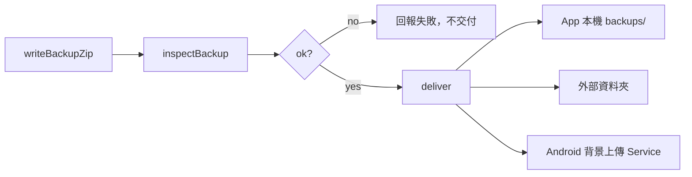

# 備份與還原

這份文件整理 Quill Diary 目前的完整備份、還原、可攜式匯入匯出，以及它們和 session、草稿、索引的邊界。

它描述的是目前程式實際怎麼運作，不把 Google Drive OAuth 細節當主線；Google 帳號連結與 OAuth 設定請看專門文件。

## 先講結論

- Quill Diary 有兩條完全不同的資料轉移路線：
  - **完整備份**：封裝整個加密 `vault/`，用途是之後完整還原
  - **可攜式匯入匯出**：處理 Markdown、HTML、第三方備份匯入，或把日記輸出成可閱讀格式
- `backup_*.zip` 和 `markdown_*.zip` 雖然都是 ZIP，格式與用途仍不同，不能混用。
- 完整備份不包含 `drafts/`、`quarantine/` 與索引資料庫，只包含正式 vault 資料；其中包含已建立的加密人物名冊 `people.json.enc`。
- 還原時會覆寫 `vault/`、刪掉索引資料庫、清空本地草稿與暫時解密附件，再依情境重建 session。
- Google Drive 備份與還原不是獨立格式；它只是同一份完整備份 zip 的另一種交付位置。

## 這份文件涵蓋哪些流程

| 類別 | 主要用途 | 代表產物 |
|------|----------|----------|
| 完整備份 | 保存整個加密日記庫，供完整還原 | `backup_YYYY-MM-DD_HH-MM-SS.zip` |
| 修復前備份 | 日記庫修復前先建立並驗證的本機完整備份 | `backup_before_repair_YYYY-MM-DD_HH-MM-SS.zip` |
| 可攜式 Markdown 匯出 | 把日記攜出閱讀、整理、散檔再匯入 | `markdown_YYYY-MM-DD_HH-MM-SS.zip` |
| 可攜式 HTML 匯出 | 匯出選取日記或回顧結果成單一 HTML | `html_YYYY-MM-DD_HH-MM-SS.html` |
| 可攜式匯入 | 從 `.md`、`.html`、`.htm`、zip 或 Easy Diary 匯入內容 | 無固定單一產物 |

## 前置條件與權限邊界

設定頁的資料轉移操作不是全部共用同一組條件，而是依 `VaultTransferCapabilities` 與當下 session 狀態決定。

### 需要已解鎖且已有 Recovery Key

- 建立本機完整備份
- 匯出完整備份到外部資料夾
- 上傳完整備份到 Google Drive

原因：

- `VaultTransferCapabilities.canBackup` 的條件是 `hasUnlockedSession && hasRecoveryKey`

### 需要已解鎖 session，但不要求 Recovery Key

- 可攜式匯出 Markdown
- 可攜式匯出 HTML
- 可攜式匯入文件

這些操作走 `runSensitiveTask(...)`，需要可用的 `UnlockedVaultSession` 才能讀寫正式日記資料。

原因：

- `VaultTransferCapabilities.canPortableTransfer` 的條件是 `hasUnlockedSession`
- 設定頁「匯入與匯出」區塊依 `canPortableTransfer` 啟用；本機/Drive 完整備份仍依 `canBackup`

### 在特定情況下可於未解鎖狀態進入還原流程

- 從本機完整備份還原
- 從外部 `backup_*.zip` 還原
- 從 Google Drive 備份下載後還原

目前規則：

- 若目前有有效解鎖 session，當然可以還原
- 若目前**沒有** Recovery Key，也可進入還原
- 若目前 lock status 已是 `recoveryRequired`，也可進入還原
- 若已有 Recovery Key、目前是一般 `locked` 狀態且不是 `recoveryRequired`，設定頁會先要求解鎖，不能直接進入還原

也就是說，`canRestore` 並不是簡單等於「一定要已解鎖」。

### Google Drive 帳號管理

- 連結 Google Drive
- 切換帳號
- 解除連結

這些不是完整備份格式的一部分，而是 Drive 帳號連線管理；目前 UI 仍要求有效解鎖 session 才能操作。

## 完整備份

完整備份會把目前 `vault/` 底下的正式資料封裝成一個 `backup_*.zip`。

### 備份內容與不包含的東西

完整備份**包含**：

- `recovery.json`
- `manifest.json.enc`
- `entries/`
- `assets/`
- `tag_styles.json`（有已保存的標籤目錄時）
- `pinned_entries.json`（有釘選項目時）
- `people.json.enc`（加密人物名冊；有建立人物時才會出現）

完整備份**不包含**：

- `drafts/`
- `quarantine/`（修復流程隔離的檔案）
- 搜尋索引資料庫（含人物提及統計衍生表）
- `app_preferences.json`

原因：

- `drafts/` 是編輯中的暫存區，不屬於正式日記庫
- 索引是衍生資料，還原後重建即可
- `app_preferences.json` 是 App 本機偏好，不屬於 vault

### 檔名與內部結構

- 檔名：`backup_YYYY-MM-DD_HH-MM-SS.zip`

```text
backup_*.zip
├── recovery.json
├── manifest.json.enc
├── entries/
├── assets/
├── tag_styles.json      （可選）
├── pinned_entries.json  （可選）
└── people.json.enc      （可選）
```

補充：

- 日記、附件與人物名冊仍是加密檔，不是明文內容；ZIP 外層未另外加密，且包含明文 `recovery.json`，以及存在時的 `tag_styles.json` 與 `pinned_entries.json`
- `index/` 目錄會在建立備份時被明確排除
- `quarantine/` 目錄也會在建立備份時被明確排除

### 完整備份建立管線

本機備份、外部資料夾匯出與 Drive 上傳共用「先建 zip、再檢查」的前半段：

1. 建立暫存 `backup_*.zip`
2. `inspectBackup(...)` 檢查 zip 結構
3. 檢查通過後才交付到實際目的地


```mermaid
flowchart LR
  W["writeBackupZip"] --> I["inspectBackup"]
  I --> D{"ok?"}
  D -->|no| X["回報失敗，不交付"]
  D -->|yes| P["deliver"]
  P --> L["App 本機 backups/"]
  P --> E["外部資料夾"]
  P --> G["Android 背景上傳 Service"]
```

本機與外部匯出仍走 [`vault_backup_service.dart`](../../../lib/infrastructure/storage/vault_backup_service.dart) 的 `_runInspectedBackupPipeline(...)`。Google Drive 則由 `prepareDriveUploadStaging(...)` 寫入 App 私有 staging，再交給 Android `BackupUploadForegroundService` 以 resumable upload 上傳。

### 設定頁中的完整備份操作

| 入口 | 實際行為 |
|------|------|
| 建立本機備份 | 備份檢查通過後，寫入 `backups/`，並只保留最新 5 份 |
| 從本機備份還原 | 從 App 內清單選一份 `backup_*.zip`，走共用 restore flow |
| 匯出備份到資料夾 | 先建立同一份完整備份，再交付到外部資料夾 |
| 匯入外部備份 | 先把選到的備份 materialize 到本機 temp file，再走共用 restore flow |
| 上傳到 Google Drive | App 內只建立並檢查備份；原生前景服務接手後以通知列顯示進度，可切換到其他 App |
| 從 Google Drive 還原 | 先下載到 temp file，再走共用 restore flow |

### 本機與 Drive 的保留份數

- App 本機完整備份只保留最新 `5` 份（含 `backup_before_repair_*.zip`，與一般本機備份共用保留池；流程見 [日記庫檢查與修復.md](./日記庫檢查與修復.md)）
- Google Drive 備份也會 prune 成最新 `5` 份
- 外部資料夾匯出不會自動輪替或刪舊檔

保留份數定義在 [`vault_backup_policy.dart`](../../../lib/domain/shared/vault_backup_policy.dart) 的 `retainCount`。

### 外部選檔與 materialize

匯入外部備份、可攜式文件匯入都先走系統選檔，再把結果 materialize 成本機可讀檔。

- 依賴版本以 [`pubspec.yaml`](../../../pubspec.yaml) 為準；目前 materialize 路徑使用 `AndroidPlatformFile`/`safHandle`（含 `releaseGrant()`），實作在 [`picked_file_materializer.dart`](../../../lib/infrastructure/storage/shared/picked_file_materializer.dart)。
- 預設不走整檔 bytes（`allowBytesFallback` 預設 `false`）。正式寫入外部資料夾在 Android 走自製 SAF channel，不依賴 `file_picker`。
- 升級或降級 `file_picker` 前，必須先確認上述 Android API 與 grant 釋放流程仍存在，並執行實機選檔/還原驗證。

## 完整備份檢查

完整備份不是只看副檔名是 `.zip` 就算通過，還會做結構檢查。

### `inspectBackup(...)` 檢查什麼

- 檔案存在且能開成有效 zip
- zip entry path 安全，沒有 `../` 這類不安全路徑
- 不是可攜式 Markdown 匯出 zip
- 含有 `recovery.json`
- 含有 `manifest.json.enc` 或至少找到一份 `entries/*.md.enc`
- `recovery.json` 可被正確解析

### 常見拒絕情況

- 備份不是有效 zip
- zip 內含不安全路徑
- 使用者拿 `markdown_*.zip` 當成完整備份
- 缺少 `recovery.json`
- 缺少加密資料
- `recovery.json` 內容損壞

這層邊界定義在 [`backup_archive_inspection.dart`](../../../lib/infrastructure/storage/portable/backup_archive_inspection.dart) 與 [`vault_backup_io.dart`](../../../lib/infrastructure/storage/portable/vault_backup_io.dart)。

## 還原

不論備份來源是：

- App 本機 `backups/`
- 外部 `backup_*.zip`
- Google Drive 下載後的 temp file

最終都會走同一條完整還原流程。

### 還原前預檢

`precheckRestore(...)` 會先讀備份內的 recovery metadata，並比對目前裝置狀態，產生 `RestorePrecheck`。

它會整理出幾個關鍵判斷：

- `sameVaultId`
- `sameRecoveryGeneration`
- `recoveryKeyRotatedSinceBackup`
- `expectsTrustedUnlockAfterRestore`
- `expectsRecoveryKeyAfterRestore`
- `canResumeTrustedSession(priorSession)`

這些值決定還原後 session 要怎麼接續，而不是單純一律要求重新輸入金鑰。

### 共用還原流程

高層流程如下：

1. `precheckRestore(...)`
2. 必要時先驗證備份對應的 recovery key
3. `restoreBackupZip(...)`
4. `finishRestoreSession(...)`
5. 依情境恢復 session、要求 recovery key，或回到一般啟動流程
6. 刷新 provider 與重建索引

### `restoreBackupZip(...)` 實際做什麼

底層 restore 並不是直接覆蓋寫入，而是先解壓到暫存位置再換目錄：

1. 將 zip 解壓到 `vault_restore_tmp`
2. 驗證解壓後 payload 至少有 `recovery.json` 與 `entries/`
3. 複製成 `vault.incoming`
4. 將舊 `vault/` 重新命名成時間戳 `.bak_*`
5. 把 `vault.incoming` 改名成正式 `vault/`
6. 成功後刪除舊備份目錄

如果中途失敗：

- 不會直接把現有 vault 清空
- 會盡量回滾到還原前狀態

### 還原時會清理什麼

還原完成後，系統會主動清理或重置：

- 關閉已解鎖 vault 資源
- 刪除索引資料庫檔案
- 刪除所有本地草稿
- 清除所有 materialize 的暫時明文附件
- 清除 recovery metadata cache
- 在必要時清除 trusted device access

其中草稿清理由 [`EditorDraftStore.deleteAll()`](../../../lib/infrastructure/storage/editor_draft_store.dart) 負責。

### 還原時不會保留什麼

- `drafts/` 不會被還原
- 編輯中的 pending 附件不會保留
- 搜尋索引檔案不會保留
- `app_preferences.json` 不會被還原

## 還原後的 session 路徑

`finishRestoreSession(...)` 會依 `RestorePrecheck` 與使用者是否提供 recovery key 決定下一步。

| 條件 | 還原後行為 |
|------|------|
| 使用者已提供備份對應的 recovery key | 走 `unlockWithRecovery(...)` |
| `canResumeTrustedSession(priorSession)` 為真 | 走 `resumeSessionAfterRestore(...)`，可沿用還原前 session |
| `expectsTrustedUnlockAfterRestore` 為真，但無法沿用 prior session | 進入 `recoveryRequired` |
| 其餘情況 | 走 `bootstrapAfterRestore()`，回到一般啟動流程 |

### 索引重建規則

- 若使用 recovery key 解鎖，索引重建由 `unlockWithRecovery(...)` 那條路徑負責
- 若不是 recovery key 解鎖、也不是沿用 trusted session，`finishRestoreSession(...)` 會主動呼叫 `rebuildIndex(...)`
- 成功進入已解鎖狀態後，會刷新首頁與 entry index 相關 provider

## 可攜式匯出

可攜式匯出不處理整個 `vault/`，而是把內容轉成方便檢視或散檔再匯入的格式。

### Markdown 匯出

- 設定頁「匯出日記」會輸出 `markdown_*.zip`
- 若庫內沒有日記，直接提示無可匯出內容，不開確認 dialog
- 匯出前會先顯示確認 dialog（與 HTML 共用摘要卡樣式）：格式、篇數、附件數、日期範圍、**估算檔案大小**，並警告**匯出後為明文**
- 確認 dialog 可：
  - **選擇日記**：另開選取 dialog，勾選要匯出的篇（預設全選）
  - **隱藏人物名稱**（預設關）：依名冊把姓名/別名換成 `人物A`/`Person A` 等代號
- 輸出內容是解密後的 Markdown 散檔與附件，不是完整備份
- 內部資料夾結構為：

```text
YYYY-MM-DD/
  標題或 fallback 名稱/
    index.md
    附件檔案...
```

### HTML 匯出

- 主畫面選取日記後可匯出 `html_*.html`
- 總覽分頁可依全部、年、月範圍匯出 `html_*.html`
- HTML 匯出是**單一 HTML 檔**
- 條目日期格式為 `yyyy-MM-dd 星期X HH:mm`（例如 `2026-10-31 星期六 10:14`）
- 匯出前一律先確認；dialog 摘要卡顯示格式、範圍、篇數、圖片、日期與**估算檔案大小**，並可：
  - **選擇日記**：另開選取 dialog，勾選範圍內要匯出的篇（預設全選）；確認 dialog 會依選取更新篇數/圖片數/檔案大小
  - **匯出圖片與附件**（預設開）：關閉則不內嵌圖片，也不輸出附件清單；檔案大小會隨之重算
  - **隱藏人物名稱**（預設關）：依名冊把姓名/別名換成 `人物A`/`Person A` 等代號
- 圖片內嵌時 `alt` 與附件清單使用通用序號（如 `image-1.webp`），副檔名依 MIME 保留，不使用原始檔名
- 勾選匯出圖片與附件且選中篇的原始圖片總量 ≥ `50 MB` 時，同一 dialog 會附大檔提示

### 可攜式往返邊界

- 可攜式匯入是**新增日記**，不保留原 `entry.id`/附件 ID/人物名冊關聯
- Markdown：內文、標籤、圖片檔多數可再匯入
- HTML：內文、標籤、任務清單、data URI 圖片可再匯入；非圖片附件僅列文字無法還原
- 隱藏人名後再匯入，正文會是代號，屬預期行為

### 可攜式匯出交付流程

1. 先確認 dialog（含明文警告與選項）
2. 在 temp directory 產生檔案
3. 讓使用者選擇外部資料夾
4. 交給 `deliverToExternalDirectory(...)`
5. Android 上實際寫入由 SAF 處理

## 可攜式匯入

可攜式匯入的目標不是覆寫整個 vault，而是把外部內容逐篇轉成 `DiaryEntry` 後寫進正式日記庫。

### 設定頁匯入入口

`importDocumentsWithPicker(...)` 的流程是：

1. 先開檔案選擇器，允許 `.zip`、`.md`、`.html`、`.htm`
2. 若使用者沒選檔，再改走外部資料夾挑選
3. 先解析成候補篇（不寫入），再開預覽確認
4. 確認後只寫入勾選篇；取消則不寫入，並清掉暫存

### 預覽確認與選篇

預覽摘要包含：

- 將匯入篇數（依勾選即時更新）
- 無法解析的檔案數
- 略過的附件數
- 可能與庫內重複的篇數

選篇規則：

- 另開選取 dialog，預設全選；至少選 1 篇才能確認
- 選取用解析順序的暫時索引，不是 vault `entry.id`

可能重複：

- 以庫內既有 `date + title` 比對；空標題改用正文預覽前綴
- 只標示候補，仍一律新增，不自動去重

Easy Diary、ZIP 與散檔/資料夾三條路徑都走同一套預覽契約。

### ZIP 匯入

ZIP 匯入流程：

1. 先解壓到 temp directory
2. 優先嘗試辨識 Easy Diary 完整備份
3. 若不是 Easy Diary，改走 Quill Diary Markdown/HTML 可攜式匯入
4. 若 ZIP 裡完全找不到可匯入內容，回傳 `zipNoEntries`

### 散檔/資料夾匯入

目前支援遞迴尋找：

- `.md`
- `.html`
- `.htm`

處理方式：

- Markdown 會解析 front matter 與本地附件參照
- Quill Diary 匯出的 HTML 會拆出 article、日期、標題、標籤、內文與附件
- data URI 圖片會直接轉成 pending attachment bytes
- 本地檔案附件只接受位於匯入根目錄底下的安全相對路徑

### 第三方來源

- 目前支援 Easy Diary 完整備份匯入
- Easy Diary 匯入器定義在 [`easy_diary_backup_import.dart`](../../../lib/infrastructure/storage/import/easy_diary/easy_diary_backup_import.dart)
- Easy Diary 圖片會先嗅探 MIME，再以 Flutter 解碼驗證；解不開（截斷、HEIC 等）會略過並計入 `skippedAttachments`

### 匯入後副作用

- 寫入正式日記庫時走 `VaultRepository.saveEntry(...)`
- 因此會沿用正式資料寫入流程與索引同步規則
- 若有成功匯入至少一篇，最後會做 `syncTagStylesBetweenVaultAndIndex()`

## Google Drive 交付流程

Google Drive 備份與還原使用相同的完整備份 ZIP，只是交付位置不同：

- 上傳時：App 先建立並檢查 `backup_*.zip`，再交給 Android `dataSync` 前景服務以 resumable upload 上傳到 `appDataFolder`
- 還原時：先下載到 temp file，再走一般 `restoreFromBackupFile(...)`

### 背景上傳生命週期

- 僅 Android；由使用者主動點擊觸發，不是自動排程同步
- 建立 ZIP 後、原生前景服務完成啟動與交接前，請保持 App 顯示在畫面上，否則 Android 12+ 可能拒絕啟動前景服務
- 交接後通知列顯示進度與停止動作；可切換 App、鎖屏或從最近工作移除 Activity；請勿強制停止 App
- **同一個 FGS 存活期間**：短暫離線會進入 `WAITING_FOR_NETWORK`，恢復後依 `retryCount` 與 `nextRetryAt` 自動重試
- **遠端完成驗證後程序終止**：保留 `STATUS_PENDING` 或 `PRUNE_PENDING`，下次啟動、回前景或進入設定時繼續記錄成功結果或 prune，不會重新上傳
- 不提供遠端完成驗證前的跨程序續傳。授權失效、重試耗盡或 FGS 啟動被拒等實際上傳失敗，仍寫入 failure notice，使用者需重新建立備份

#### 取消與異常中止（`CANCEL_CLEANUP_PENDING`）

下列情況都會先寫入 `CANCEL_CLEANUP_PENDING` 並中止傳輸，**不**建立 failure notice：

- 使用者主動停止
- dataSync 額度逾時（`onTimeout`）
- 服務銷毀（`onDestroy`）
- crash／強制停止後的冷啟動 leftover

接著以 `DriveRemoteFileCleanup.completeCancelCleanup()` 查詢遠端：

- 已驗證完成 → 升 `STATUS_PENDING`／`PRUNE_PENDING`，走原本成功收尾
- 尚未通過驗證 → 刪除殘檔後清本機 job
- 查詢暫時失敗（`RetryLater`）→ 保留 pending；UI 顯示「正在清除未完成的 Google Drive 備份…」，下次再試

對帳完成前不能開始新的上傳。

對帳觸發時機：

1. 使用者停止且 worker 已退出
2. 系統逾時／服務銷毀時，若 worker 已不在，立刻排程對帳
3. worker `finally`
4. 下次啟動、回前景或進入設定時的 `getState`

worker 是否已退出以 `uploadWorkerAlive` 為準（`Future.cancel` 後 `isDone` 不代表執行緒已結束；`startUpload`／重試／網路恢復也看此旗標）：

- 使用者停止後最多等待約 15 秒；逾時仍未退出則保留 pending，由 `finally` 或下次 `getState` 再對帳
- 服務銷毀時若短等待後執行緒仍未退出，保留 `uploadWorkerAlive` 並只推 pending，避免對尚在跑的 HTTP 誤刪；行程結束後 companion 旗標會重置

### 成功收尾

持久狀態只保留：

```text
STAGED → UPLOADING ⇄ WAITING_FOR_NETWORK → STATUS_PENDING → PRUNE_PENDING
                                    ↘ CANCEL_CLEANUP_PENDING →（刪 job 或升 STATUS_PENDING）
```

- `STATUS_PENDING`：遠端內容已驗證，等待 App 以 `jobId` 冪等寫入本機成功紀錄
- `PRUNE_PENDING`：成功紀錄已完成，等待刪除多餘的 Drive 備份；prune 失敗可在下次啟動、回前景或進入設定時重試，不會重傳檔案
- `CANCEL_CLEANUP_PENDING`：取消或異常中止後，等待確認遠端檔再刪本機 job，或升為 `STATUS_PENDING`；對帳完成前會擋住新的上傳
- prune 完成後 finalize，刪除本機 job 與 staging；失敗、取消與完成都不保留額外終態
- 遠端完成驗證要求 `remoteFileId`、檔案大小、`uploadJobId` 與 Drive `md5Checksum` 全部符合；本機 MD5 只在 staging 建立後計算一次

所以：

- Drive 備份內容和本機完整備份相同
- Drive 還原的核心流程也和本機/外部 ZIP 相同

OAuth、帳號切換、scope 與權限頁細節請看 [../google/Google-Drive-OAuth-設定.md](../google/Google-Drive-OAuth-設定.md)。

## 完整備份與可攜式匯出的差異

| 項目 | 完整備份 | 可攜式匯出 |
|------|------|------|
| 主要用途 | 完整保存與完整還原日記庫 | 攜出內容、閱讀、整理或再匯入 |
| 檔名 | `backup_*.zip` | `markdown_*.zip`/`html_*.html` |
| 內容 | 正式 `vault/`；日記、附件與人物名冊加密，部分輔助 metadata 為明文 | 解密後的 Markdown/HTML |
| 是否可直接 restore vault | 可以 | 不可以 |
| 是否包含 `drafts/` | 不包含 | 不適用 |
| 是否包含索引資料庫 | 不包含 | 不適用 |
| 是否會做完整備份結構檢查 | 會，走 `inspectBackup(...)` | 不會走同等 restore 檢查 |

## 與其他模組的邊界

- 草稿與 pending 附件不屬於完整備份範圍，請看 [日記編輯器.md](./日記編輯器.md)
- 還原後索引會刪除並重建，請看 [../資料/索引資料庫.md](../資料/索引資料庫.md)
- `backup_*.zip` 是未再加密的容器；內含 LDJ2 加密日記與部分明文 metadata。本文件的「備份內容與不包含的東西」說明 ZIP 封裝邊界；LDJ2 與 recovery metadata 格式另見 [../安全/加密格式.md](../安全/加密格式.md)
- 還原後 session 如何接續，請看 [../安全/解鎖與會話.md](../安全/解鎖與會話.md)

## 主要程式位置

| 元件 | 檔案 |
|------|------|
| 設定頁高層操作 | [`settings_flow_controller.dart`](../../../lib/application/settings/settings_flow_controller.dart) |
| 完整備份/還原/匯入匯出服務 | [`vault_transfer_service.dart`](../../../lib/infrastructure/storage/vault_transfer_service.dart) |
| 備份/還原/匯出/匯入 I/O 門面 | [`vault_archive_io.dart`](../../../lib/infrastructure/storage/vault_archive_io.dart) |
| 完整備份 I/O | [`vault_backup_io.dart`](../../../lib/infrastructure/storage/portable/vault_backup_io.dart) |
| 可攜式匯出 | [`portable_export_io.dart`](../../../lib/infrastructure/storage/portable/portable_export_io.dart) |
| 可攜式匯入 | [`portable_import_io.dart`](../../../lib/infrastructure/storage/portable/portable_import_io.dart) |
| 可攜式匯入預覽契約 | [`portable_import_preview.dart`](../../../lib/infrastructure/storage/portable/portable_import_preview.dart) |
| 還原前預檢 | [`restore_precheck.dart`](../../../lib/infrastructure/storage/restore_precheck.dart) |
| 還原流程協調 | [`restore_backup_flow.dart`](../../../lib/application/restore/restore_backup_flow.dart) |
| 還原後 session 重建 | [`post_restore_session.dart`](../../../lib/application/restore/post_restore_session.dart) |
| 檔名與保留份數規則 | [`vault_backup_policy.dart`](../../../lib/domain/shared/vault_backup_policy.dart) |
| Drive 備份與還原 API | [`drive_backup_service.dart`](../../../lib/infrastructure/drive/drive_backup_service.dart) |
| Drive 背景上傳協調 | [`drive_upload_coordinator.dart`](../../../lib/application/settings/drive_upload_coordinator.dart) |
| Flutter/Android 上傳橋接 | [`drive_upload_platform.dart`](../../../lib/infrastructure/drive/drive_upload_platform.dart) |
| Android 前景服務 | [`BackupUploadForegroundService.kt`](../../../android/app/src/main/kotlin/zack20136/com/quill_diary/drive/BackupUploadForegroundService.kt) |

## 測試與驗證線索

- [`vault_backup_restore_test.dart`](../../../test/infrastructure/storage/vault_backup_restore_test.dart)：驗證完整備份檢查、還原成功、草稿清理與損壞備份不應清空現有 vault。
- [`backup_safety_test.dart`](../../../test/infrastructure/storage/backup_safety_test.dart)：驗證不安全路徑、索引排除，以及完整備份還原人物名冊後只保留備份當下資料且可正常解密查詢。
- [`restore_precheck_test.dart`](../../../test/infrastructure/storage/restore_precheck_test.dart)：驗證還原後 trusted session/Recovery Key 判斷規則。
- [`portable_date_text_test.dart`](../../../test/infrastructure/storage/portable_date_text_test.dart)：驗證可攜式匯出日期含星期格式與解析。
- [`portable_export_import_roundtrip_test.dart`](../../../test/infrastructure/storage/portable_export_import_roundtrip_test.dart)：驗證 Markdown/HTML 匯出再匯入、選篇匯出與隱藏人名。
- [`portable_import_preview_test.dart`](../../../test/infrastructure/storage/portable_import_preview_test.dart)：驗證匯入預覽計數、可能重複標記、選部分篇寫入與取消不寫入。
- [`vault_transfer_capabilities_test.dart`](../../../test/application/settings/vault_transfer_capabilities_test.dart)：驗證可攜式匯入/匯出只需解鎖，完整備份仍需 Recovery Key。
- [`html_export_estimate_test.dart`](../../../test/infrastructure/storage/html_export_estimate_test.dart)：驗證 HTML 匯出候補摘要與選取後重算。
- [`html_export_person_anonymizer_test.dart`](../../../test/infrastructure/storage/html_export_person_anonymizer_test.dart) 與 [`person_name_matcher_test.dart`](../../../test/domain/people/person_name_matcher_test.dart)：驗證可攜式匯出隱藏人物名稱與姓名區間掃描。
- [`easy_diary_photo_resolver_test.dart`](../../../test/infrastructure/storage/easy_diary_photo_resolver_test.dart)：驗證 Easy Diary 圖片解碼檢查與略過不可解碼檔。
- [`drive_upload_coordinator_test.dart`](../../../test/application/settings/drive_upload_coordinator_test.dart) 與 [`drive_upload_job_test.dart`](../../../test/infrastructure/drive/drive_upload_job_test.dart)：驗證 Flutter 上傳狀態協調與平台資料解碼。
- [`DriveUploadJobStoreTest.kt`](../../../android/app/src/test/java/zack20136/com/quill_diary/drive/DriveUploadJobStoreTest.kt) 與 [`DriveResumableUploaderTest.kt`](../../../android/app/src/test/java/zack20136/com/quill_diary/drive/DriveResumableUploaderTest.kt)：驗證原生 job 持久狀態、清理邊界與 resumable upload。
- [`DriveCancelStopDecisionTest.kt`](../../../android/app/src/test/java/zack20136/com/quill_diary/drive/DriveCancelStopDecisionTest.kt) 與 [`DriveRemoteFileCleanupTest.kt`](../../../android/app/src/test/java/zack20136/com/quill_diary/drive/DriveRemoteFileCleanupTest.kt)：驗證停止決策、`CANCEL_CLEANUP_PENDING` 對帳與遠端檔 DELETE。
- 若之後調整完整備份結構、restore 流程、可攜式匯入預覽或前置條件，至少要同步檢查 `vault_transfer_service.dart`、`vault_backup_io.dart`、`portable_import_io.dart`、`restore_precheck.dart`、`post_restore_session.dart` 與設定頁相關文案。

---

[← 返回開發文件導覽](../README.md)
