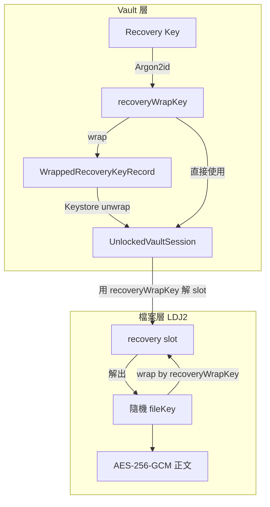
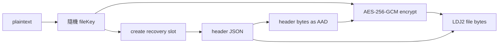

# 加密格式

這份文件整理 Quill Diary 目前使用的 `LDJ2` 加密格式，包括檔案結構、recovery slot、vault 層與檔案層的金鑰分工，以及解密與重包裝路徑。

它只講加密資料本身，不重講 UI 解鎖流程、背景逾時或設定頁互動。

## 先講結論

- `LDJ2` 是單一檔案的加密封裝格式，不是整個 vault 的解鎖流程。
- Quill Diary 的加密設計分成兩層：
  - **vault 層**：管理 `recoveryWrapKey`、trusted device 包裝材料與 `recovery.json`
  - **檔案層**：每個 `.enc` 檔案各自有 `fileKey`、header 與 recovery slot
- 新寫入的 LDJ2 檔案目前**只會寫 recovery slot**，不會在每個檔案 header 裡再放 device slot。
- `recoveryWrapKey` 不是直接拿來解正文；它先解 recovery slot，拿到該檔自己的 `fileKey`，再由 `fileKey` 解正文。
- 搜尋索引金鑰不是另外存在 metadata，而是由 `recoveryWrapKey` 透過 HKDF 衍生。

## 這個格式在做什麼

`LDJ2` 用來保護：

- 日記本文
- `manifest.json.enc`
- 正式附件 `.enc`
- 草稿 JSON `.enc`
- 草稿 pending 附件 `.enc`

它採用的是 **envelope encryption**：

- 每個檔案都有自己的隨機 `fileKey`
- 正文用 `AES-256-GCM` 加密
- `fileKey` 會被包成檔案 header 裡的 recovery slot
- session 只要持有正確的 `recoveryWrapKey`，就能先解 slot，再解正文

這代表：

- 檔案彼此不共用 `fileKey`
- trusted device 與 recovery key 最終都會匯流成同一把 `recoveryWrapKey`
- 每個檔案只需要知道「如何用 recoveryWrapKey 解出 fileKey」，不需要知道 Android Keystore 細節

## 兩層金鑰架構



| 層級 | 金鑰 / 材料 | 存放位置 | 用途 |
|------|-------------|----------|------|
| Vault 層 | `recoveryWrapKey` | 由 Recovery Key 經 Argon2id 衍生；trusted device 時會被包裝後存進 Keystore + secure storage | 解各檔 recovery slot、衍生索引金鑰 |
| Vault 層 | `WrappedRecoveryKeyRecord` | secure storage 中的 JSON record，密文本體對應 Android Keystore slot | 讓 trusted device 路徑能恢復 `recoveryWrapKey` |
| 檔案層 | `fileKey` | 不明文落地，只存在每個檔案的 recovery slot 內 | 解該檔案正文 |

## `recovery.json`

`vault/recovery.json` 是**明文 metadata**，不是日記內容，也不是可直接解檔的密鑰本體。

它目前包含：

- `schema_version`
- `vault_id`
- `recovery_enabled`
- `recovery_key_version`
- `recovery_key_hint`
- `created_at`
- `kdf`

其中 `kdf` 內會記錄：

- `name`
- `salt`
- `memory`
- `parallelism`
- `iterations`
- `hash_length`
- 額外的 `purpose: recovery_wrapping`

### 目前實作的 KDF 預設值

- 演算法：`argon2id`
- `memory`: `19456` KiB
- `iterations`: `3`
- `parallelism`: `1`
- `hash_length`: `32`
- salt 最少 `16` bytes

補充：

- `recovery_key_version` 目前必須 `>= 1`
- 真正判斷是否為同一代 recovery key，實作主要看的是 `kdf.saltBase64`，不是單靠 `recovery_key_version`

## LDJ2 檔案結構

每個加密檔案的位元組格式如下：

```text
[magic "LDJ2" 4B][header length uint32 BE][header JSON bytes][ciphertext || GCM tag]
```

重點：

- magic 固定為 `LDJ2`
- header length 是 4 bytes big-endian
- header 是 JSON UTF-8 bytes
- 內容加密演算法目前固定為 `aes-256-gcm`
- header bytes 本身會當成 AES-GCM 的 AAD

最後一點非常重要：header 參與驗證，所以竄改 header 會讓正文驗證失敗。

## Header 結構

LDJ2 header 目前對應 [`EncryptedDocumentHeader`](../../../lib/infrastructure/crypto/crypto_service.dart)，包含：

| 欄位 | 說明 |
|------|------|
| `schema_version` | 目前固定為 `1` |
| `file_id` | 邏輯上的文件 id，例如 entry id、asset id 或 `manifest` |
| `vault_id` | 這個檔案屬於哪個 vault |
| `content_type` | 原始內容型別，例如 `text/markdown`、`application/json` |
| `created_at` | 邏輯建立時間 |
| `updated_at` | 邏輯更新時間 |
| `cipher` | 目前固定 `aes-256-gcm` |
| `nonce` | 正文 AES-GCM nonce，base64 |
| `key_slots` | 金鑰槽清單，目前至少有 recovery slot |

### `key_slots` 目前的限制

- 至少要有一個 `slot_type == "recovery"` 的 slot
- 目前不支援其他 slot type；遇到未知 slot type 會直接失敗
- 新檔寫入時只會建立單一 recovery slot

## Recovery Slot 結構

每個 recovery slot 對應 [`EncryptionKeySlot`](../../../lib/infrastructure/crypto/crypto_service.dart)，目前欄位如下：

| 欄位 | 說明 |
|------|------|
| `slot_id` | 目前固定寫成 `recovery` |
| `slot_type` | 固定為 `recovery` |
| `wrap_algorithm` | 目前固定 `aes-256-gcm` |
| `wrapped_key` | 被 `recoveryWrapKey` 包起來的 `fileKey`，base64 |
| `nonce` | slot 自己的 GCM nonce，base64 |
| `kdf` | 對應 recovery metadata 的 KDF 描述 |
| `platform` | 目前 recovery slot 不一定使用，只有欄位保留能力 |

### 這代表什麼

- 每個檔案各自有自己的 `fileKey`
- session 只要有 `recoveryWrapKey`，就能解這個 slot
- trusted device 不是直接解檔；它只是先把 vault 層的 `recoveryWrapKey` 恢復出來

## 寫入流程



實際順序：

1. 產生隨機 `fileKey`
2. 用 `recoveryWrapKey` 建 recovery slot，把 `fileKey` 包起來
3. 產生正文 GCM nonce
4. 組出 header JSON
5. 將 **canonical header bytes** 當作 AAD，加密正文
6. 輸出 `LDJ2 + header length + header bytes + ciphertext+tag`

目前新檔寫入時：

- 不會建立 per-file device slot
- 不會在 header 裡留下 Android Keystore slot id

## Trusted Device 在哪一層

trusted device 保護的是 **vault 層的 recoveryWrapKey**，不是每個檔案的 `fileKey`。

### 目前使用的 record

trusted device 相關材料是 [`WrappedRecoveryKeyRecord`](../../../lib/infrastructure/security/device_key_manager.dart)，欄位包含：

- `slot_id`
- `nonce`
- `ciphertext`
- `wrapped_at`
- `format_version`
- `platform`

這份 record 會存在 secure storage，而真正的 unwrap 需透過 Android Keystore。

### trusted device 路徑

1. 讀取 `WrappedRecoveryKeyRecord`
2. 透過 `DeviceKeyManager.unwrapWithDeviceKey(...)` 從 Keystore 解出 `recoveryWrapKey`
3. 產生 `UnlockedVaultSession(recoveryWrapKey: ..., trustedDevice: true, deviceSlotId: ...)`
4. 之後各檔還是透過 recovery slot 解出 `fileKey`

所以文件上若寫成「每個 `.enc` 檔都包含 device slot」會是錯的。

## Recovery Key 如何變成 `recoveryWrapKey`

使用者輸入的 Recovery Key 不會直接拿來解檔。

流程是：

1. 讀取 `recovery.json` 的 KDF 參數
2. 用 Argon2id 衍生 `recoveryWrapKey`
3. 先拿這把 key 驗證既有加密檔是否能正確解開
4. 成功後才建立 session 或進行 rewrap

這把 key 的用途：

- 解各檔 recovery slot
- 重新包裝 trusted device 的 wrapped recovery key
- 衍生搜尋索引資料庫金鑰

## 搜尋索引金鑰衍生

索引資料庫金鑰不是獨立儲存在 `recovery.json`。

目前做法是：

- 以 `recoveryWrapKey` 當 HKDF secret
- `vaultId` 當 HKDF nonce
- `AppIdentifiers.indexKeyDerivationInfo` 當 HKDF info
- 輸出長度 `32` bytes

也就是：

```text
HKDF-SHA256(
  secret = recoveryWrapKey,
  nonce = utf8(vaultId),
  info = "quill_diary:index:v1",
  len = 32
)
```

這條邏輯實作在 [`index_key_derivation.dart`](../../../lib/infrastructure/database/index_key_derivation.dart)。

## 解密邏輯

解密入口是 `CryptoService.decryptBytes(...)` / `decryptMarkdown(...)`。

### 目前實作的必要條件

- header 必須能 parse
- `schema_version == 1`
- `cipher == "aes-256-gcm"`
- header 內要有至少一個 recovery slot
- `DecryptionContext` 內要提供 `recoveryWrapKey`

### 目前流程

1. parse LDJ2 magic、header length、header JSON
2. 驗證 header 基本格式
3. 從 `key_slots` 找到 `slot_type == "recovery"` 的 slot
4. 用 `recoveryWrapKey` 解出 `fileKey`
5. 用 `fileKey` + header bytes(AAD) 解正文

目前 `decryptBytes(...)` 雖然接受 `trustedDevice`、`deviceSlotId` 這些欄位，但真正的檔案解密還是只看 `recoveryWrapKey`。

## 失敗條件

以下情況都應直接失敗，不回傳部分內容：

- magic 不是 `LDJ2`
- header length 異常
- header JSON 格式錯誤
- `schema_version` 不支援
- `cipher` 不是 `aes-256-gcm`
- 缺少 recovery slot
- slot nonce 或正文 nonce 長度錯誤
- `recoveryWrapKey` 錯誤
- header 被竄改
- ciphertext 或 tag 被竄改

特別是：

- 竄改 header 中的 `updated_at` 這類中繼資料，也會因為 AAD 驗證失敗而整體解密失敗

## Manifest 的角色

`vault/manifest.json.enc` 是目前 vault 驗證與 restore 驗證的重要樣本檔。

### 本機 vault 驗證

`VaultRepository._verifyRecoveryKey(...)` 會：

1. 先嘗試解 `manifest.json.enc`
2. 若 manifest 不存在，再 fallback 驗證其他加密檔

fallback 規則：

- 優先 `entries/**/*.md.enc`
- 其次 `entries|assets/**/*.enc`
- 不把 manifest 自己再算一次

### 備份 zip 驗證

`verifyRecoveryKeyAgainstBackupBytes(...)` 不會把整份備份還原出來驗證，而是：

1. 先從 zip 讀 `manifest.json.enc`
2. 若沒有 manifest，再讀第一份可用的 `.md.enc` 樣本
3. 用使用者輸入的 Recovery Key 衍生 `recoveryWrapKey`
4. 嘗試解該樣本

如果驗證失敗，會丟出：

- `復原金鑰與此備份不相符。請輸入建立該備份時保存的復原金鑰。`

## 何時會重包裝（rewrap）

目前至少有兩類情境會重新寫過整批 `.enc` 檔案：

### 輪替 Recovery Key

- 先產生新的 KDF 與新的 `recoveryWrapKey`
- 將所有加密檔逐一解密，再用新的 `recoveryWrapKey` 重新加密
- 最後才更新 `recovery.json`

### 用 Recovery Key 解鎖後重建 trusted device

- 先用 Recovery Key 衍生出 `recoveryWrapKey`
- 驗證成功後，重新包裝 trusted device 材料
- 同時重新寫過 vault 內加密檔，確保狀態一致

補充：

- 若過程中中斷，索引 app values 可能留下 `rewrap_in_progress` 旗標
- 下次開啟時會嘗試續跑

## 與其他文件的邊界

- 解鎖畫面、背景逾時、resume、trusted device 模式切換與 session 狀態，請看 [解鎖與會話.md](./解鎖與會話.md)
- 搜尋索引生命週期與何時重建，請看 [../資料/索引資料庫.md](../資料/索引資料庫.md)
- 備份 zip 封裝哪些加密資料，請看 [../功能/備份與還原.md](../功能/備份與還原.md)

## 主要程式位置

| 元件 | 檔案 |
|------|------|
| LDJ2 格式與加解密實作 | [`crypto_service.dart`](../../../lib/infrastructure/crypto/crypto_service.dart) |
| Recovery metadata 模型 | [`recovery_metadata.dart`](../../../lib/domain/recovery/recovery_metadata.dart) |
| Argon2id KDF 描述 | [`kdf_descriptor.dart`](../../../lib/domain/recovery/kdf_descriptor.dart) |
| Vault 層 trusted device 包裝材料 | [`device_key_manager.dart`](../../../lib/infrastructure/security/device_key_manager.dart) |
| Vault 驗證、解鎖、rewrap、manifest 寫入 | [`vault_repository.dart`](../../../lib/infrastructure/storage/vault_repository.dart) |
| 索引金鑰衍生 | [`index_key_derivation.dart`](../../../lib/infrastructure/database/index_key_derivation.dart) |

## 測試與驗證線索

- [`local_crypto_service_test.dart`](../../../test/infrastructure/crypto/local_crypto_service_test.dart)：驗證 recovery slot round-trip、header AAD 防竄改、以及不產生 device slot。
- [`index_key_derivation_test.dart`](../../../test/infrastructure/crypto/index_key_derivation_test.dart)：驗證 HKDF 衍生規則。
- [`verify_backup_recovery_key_test.dart`](../../../test/infrastructure/storage/verify_backup_recovery_key_test.dart)：驗證備份樣本檔的 recovery key 驗證路徑。
- 若之後調整 header 欄位、slot 結構、KDF 參數或 trusted device 表示法，至少要同步檢查 `crypto_service.dart`、`vault_repository.dart`、`device_key_manager.dart` 與這份文件。

---

[← 返回開發文件導覽](../README.md)
