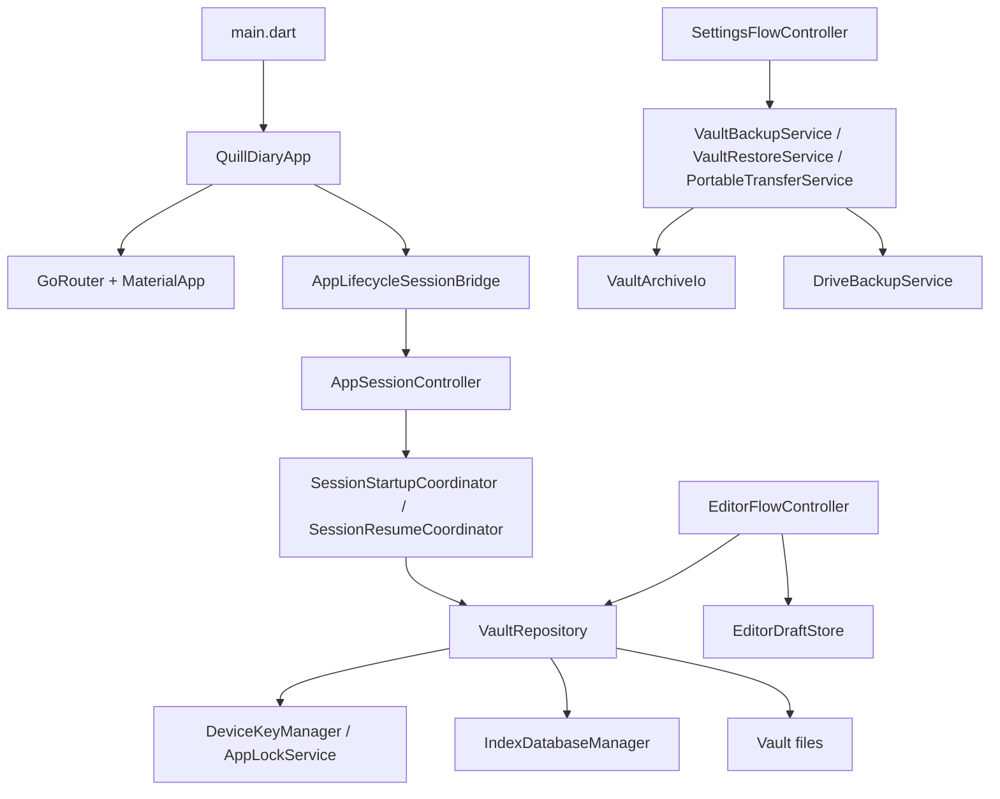

# 系統架構

這份文件整理 Quill Diary 目前的靜態架構，包括分層、主要模組、啟動 wiring、核心資料邊界與本機資料落點。

它只回答三件事：

- 東西放在哪一層
- 哪個模組負責什麼
- 各模組怎麼接起來

執行流程、解鎖細節、索引生命週期、備份操作與編輯器行為，請看對應主題文件。

## 先講結論

- 這不是單純的 Flutter 畫面專案，而是一個「本機加密日記庫 + session + 索引 + 備份交付」系統。
- `app / presentation / application / domain / infrastructure / shared` 六層目前都有明確責任，不是只靠資料夾分類。
- `VaultRepository` 不是唯一資料層；正式資料、草稿、索引、外部備份、Drive 備份與本機偏好分散在不同元件。
- `VaultPathStrategy` 是本機資料路徑的單一入口；`storage_providers.dart` 是主要 infrastructure 組裝點。

## 產品導向

Quill Diary 的架構核心不是「做一個文字編輯器」，而是「做一個以本機為主、加密保存、可重新解鎖、可搜尋、可備份與可還原的私人日記系統」。

目前整體設計圍繞這些目標：

- 正式日記與附件以加密格式存在 `vault/`
- 使用者可透過 trusted device 或 Recovery Key 恢復存取權
- 搜尋索引只在有效解鎖 session 期間開啟
- 草稿與正式資料明確分離
- 完整備份、可攜式匯出、外部資料夾交付與 Drive 備份分開設計
- 個人化偏好與解鎖偏好不混進正式日記庫

補充：目前 runtime 主要以 Android 為正式支援平台。

## 專案分層

| 目錄 | 角色 |
|------|------|
| `lib/app/` | App shell、router、theme、app-level wiring |
| `lib/presentation/` | 頁面、widget、使用者互動、feature UI 組裝 |
| `lib/application/` | flow、controller、coordinator、provider 與跨模組流程協調 |
| `lib/domain/` | 穩定模型、value object、與 feature 無關的核心型別 |
| `lib/infrastructure/` | 實際儲存、加密、索引、裝置安全、Drive、Billing、Markdown codec |
| `lib/shared/` | 跨功能共用的 UI primitive、格式化與平台工具 |
| `lib/l10n/` | ARB 文案與在地化委派 |

分層原則：

- `presentation` 不直接決定底層儲存格式。
- `application` 把 session、editor、settings、restore、home 等流程串成可執行行為。
- `domain` 不依賴 Flutter UI 或平台整合。
- `infrastructure` 專心處理實際 I/O、加密、資料庫、外部服務與裝置能力。
- `shared` 只放跨功能共用、但不適合歸進單一 feature 的內容。

## App Shell 與入口

應用程式入口非常薄：

- [`main.dart`](../../../lib/main.dart) 只做 `WidgetsFlutterBinding.ensureInitialized()` 與 `ProviderScope`
- [`app.dart`](../../../lib/app/app.dart) 才是實際 app shell

`QuillDiaryApp` 目前負責：

- 建立 `GoRouter`
- attach `AppLifecycleSessionBridge`
- 綁定 session 導頁協調器
- 讀取個人化偏好決定 `locale` 與 `themeMode`
- 啟動 billing lifecycle provider

也就是說，`app/` 不是單純放 theme 與 route 常數；它負責把 session lifecycle、router 與 app-level provider wiring 接起來。

## Router 結構

目前 route 很精簡，集中在 [`router.dart`](../../../lib/app/router.dart)：

| Route | 頁面 |
|------|------|
| `/` | Home |
| `/editor` | 新建日記 |
| `/editor/:entryId` | 編輯既有日記 |
| `/settings` | 設定首頁 |
| `/settings/about` | 介紹 |
| `/settings/personalization` | 個人化 |
| `/settings/support` | 支持 |

這表示目前 app shell 採單一 router、少量主路徑，feature 間主要靠 provider 與 controller 協調，而不是複雜 nested router。

## 主要功能模組

從 `application/` 與 `presentation/` 的實際結構來看，目前可分成幾個主要 feature：

| 模組 | 主要內容 |
|------|----------|
| Session | 啟動、trusted unlock、背景逾時、resume 解鎖、手動鎖定、restore 後 session 重建 |
| Home | 日記列表、日曆、標籤、總覽、搜尋、釘選與部分匯出入口 |
| Editor | 建立與編輯日記、附件 staging、草稿、預覽與正式提交 |
| Settings | Recovery Key、備份還原、Drive 連線、個人化、介紹、支持與修復工具 |
| Restore | 還原完成後的 precheck、session 接續與畫面結果收尾 |
| Tag | 標籤 catalog、樣式與 UI 關聯資料 |

補充：

- `Restore` 現在不是完全附屬於 settings callback 內的雜湊邏輯，而是有自己的 `application/restore/` 模組。
- `Drive` 與 `Billing` 雖然主要由設定頁觸發，但邏輯實作在 infrastructure，不屬於 presentation feature 本身。

## `application/` 層在做什麼

`application/` 目前不是單純放 provider，而是實際承擔「流程協調層」。

幾個代表性模組：

| 模組 | 職責 |
|------|------|
| `session/` | session 狀態機、startup coordinator、resume coordinator、lifecycle/navigation 協調 |
| `editor/` | 編輯器提交流程、draft provider、圖片 staging、正文 block 處理 |
| `settings/` | 設定頁動作編排、unlock mode change flow、Drive / backup / repair 回饋 |
| `restore/` | restore precheck 結果接手、restore 後 session 決策 |
| `home/` | 日記列表查詢、瀏覽狀態與首頁索引快取刷新 |
| `tag/` | 標籤 catalog 與 UI 需要的聚合資料 |

代表性 controller / coordinator：

- `AppSessionController`
- `SessionStartupCoordinator`
- `SessionResumeCoordinator`
- `EditorFlowController`
- `SettingsFlowController`

這層的特徵是：

- 它知道多個 repository / service / provider 之間該怎麼串
- 但不直接做實際加密、SQLite 開檔、Drive API 呼叫或檔案系統寫入

## `infrastructure/` 層在做什麼

`infrastructure/` 是目前真正的執行引擎，範圍比「storage」更大，至少包含：

| 子模組 | 職責 |
|--------|------|
| `storage/` | vault、草稿、備份 zip、portable import/export、外部交付、restore precheck |
| `crypto/` | `LDJ2` 加解密、header / slot 處理、Recovery Key 衍生 |
| `database/` | 加密 SQLite 索引、索引 key 衍生、schema 管理 |
| `security/` | trusted device、Keystore、unlock mode、裝置能力檢查 |
| `drive/` | Google Drive appDataFolder 備份上傳、列舉、下載、帳號連線 |
| `billing/` | Google Play Billing 一次性支持 |
| `preferences/` | vault 外偏好儲存 |
| `markdown/` | front matter 與 Markdown 相關 codec |

這代表目前架構不是「只有一個 repository 包全部」；實際上是多個 infrastructure 元件組成的網路。

## 主要 infrastructure 邊界

### `VaultRepository`

[`vault_repository.dart`](../../../lib/infrastructure/storage/vault_repository.dart) 是正式日記庫的核心入口，但它只管「正式 vault 與其解鎖語意」。

主要責任：

- 初始化 vault 目錄與讀取 `recovery.json`
- 建立 Recovery Key、trusted device、trusted session
- 讀寫 entry / asset / manifest
- 驗證與修復 vault 內正式資料
- 協調索引 attach、rebuild 與 Keystore 狀態同步

它不直接負責：

- 草稿目錄管理
- 外部資料夾交付 UI
- Google Drive 備份
- 個人化偏好

### `EditorDraftStore`

[`editor_draft_store.dart`](../../../lib/infrastructure/storage/editor_draft_store.dart) 專門負責 `drafts/`。

主要責任：

- 讀寫 `draft.json.enc`
- 管理 `pending/*.enc`
- 為附件預覽暫時 materialize 解密檔到系統 temp
- 列出仍存在的 draft key

重點是：草稿和正式日記庫分離，且 preview 解密檔不留在 vault 內。

### `IndexDatabaseManager`

[`index_database_manager.dart`](../../../lib/infrastructure/database/index_database_manager.dart) 管理加密搜尋索引資料庫。

主要責任：

- 依 `UnlockedVaultSession` 開啟索引
- 由 `recoveryWrapKey + vaultId` 衍生索引 key
- 關閉資料庫
- 刪除損壞或不相容的 SQLite 檔案

它不擁有正式日記主資料，只擁有衍生搜尋資料。

### Backup / Restore / Portable transfer services

目前設定頁的備份、還原與匯入匯出流程，主要由下列 capability service 直接承接：

- [`vault_backup_service.dart`](../../../lib/infrastructure/storage/vault_backup_service.dart)
- [`vault_restore_service.dart`](../../../lib/infrastructure/storage/vault_restore_service.dart)
- [`portable_transfer_service.dart`](../../../lib/infrastructure/storage/portable_transfer_service.dart)

[`vault_transfer_service.dart`](../../../lib/infrastructure/storage/vault_transfer_service.dart) 仍保留作為相容 façade，但新呼叫端應優先依賴上述較小、職責單一的 service。

主要責任：

- `VaultBackupService`：建立完整備份 zip、寫入 app local backups、交付到外部資料夾、上傳 Google Drive 與保留數清理
- `VaultRestoreService`：restore picker、backup inspect / precheck、Google Drive 下載、restore 前暫存檔準備與 restore 執行
- `PortableTransferService`：portable markdown / html 匯出、portable import 與挑選檔案材料化

這些 service 底下再委派給：

- `VaultArchiveIo`
- `DriveBackupService`
- `ExternalDirectoryStore`
- `PickedFileMaterializer`

### `DriveBackupService`

[`drive_backup_service.dart`](../../../lib/infrastructure/drive/drive_backup_service.dart) 是 Google Drive appDataFolder 備份的邊界。

主要責任：

- Google 帳號連線 / 切換 / 中斷
- 上傳完整備份 zip
- 列出與刪除遠端備份
- 下載備份到 temp
- 控制 retain count 清理舊備份

這條路徑是「備份交付通道」，不是正式日記讀寫通道。

### `AppLockService` / `DeviceKeyManager`

這兩個 security 元件共同承擔 trusted device 邊界：

- `AppLockService`：保存 unlock mode 偏好、讀裝置能力
- `DeviceKeyManager`：跟 Android Keystore 與 secure storage 互動

session 邏輯在 application 層，但裝置安全的實作責任在 infrastructure 層。

## Provider 組裝點

目前最重要的 infrastructure 組裝點是 [`storage_providers.dart`](../../../lib/infrastructure/storage/storage_providers.dart)。

它把以下依賴串起來：

- `VaultPathStrategy`
- `CryptoService`
- `IndexDatabaseManager`
- `DeviceKeyManager`
- `AppLockService`
- `VaultRepository`
- `EditorDraftStore`
- `VaultArchiveIo`
- `VaultBackupService`
- `VaultRestoreService`
- `PortableTransferService`

這個結構反映出目前的依賴方向：

1. path / crypto / database / security 是底層基礎能力
2. `VaultRepository` 與 `EditorDraftStore` 建在這些能力之上
3. `VaultArchiveIo` 再建立在 vault + draft + index 之上
4. backup / restore / portable transfer capability service 再建立在 archive + drive + external delivery 之上

## 本機資料路徑

本機資料根目錄由 [`VaultPathStrategy`](../../../lib/infrastructure/storage/vault_path_strategy.dart) 統一提供。

所有相對路徑都位於：

- `{appSupport}/quill_diary/`

主要落點如下：

| 路徑 | 內容 |
|------|------|
| `vault/recovery.json` | 明文 Recovery metadata 與 KDF 描述 |
| `vault/manifest.json.enc` | 加密 manifest |
| `vault/entries/YYYY/MM/*.md.enc` | 正式日記內容 |
| `vault/assets/YYYY/MM/*.<ext>.enc` | 正式附件 |
| `vault/tag_styles.json` | 明文標籤樣式 |
| `vault/pinned_entries.json` | 首頁釘選狀態 |
| `index/journal_index.sqlite` | 加密搜尋索引資料庫 |
| `drafts/{draftKey}/draft.json.enc` | 加密草稿主檔 |
| `drafts/{draftKey}/pending/*.enc` | 待提交附件暫存 |
| `backups/backup_*.zip` | 本機完整備份 |
| `app_preferences.json` | vault 外個人化偏好 |
| `app_lock_store.json` | vault 外解鎖模式偏好 |

路徑語意：

- `vault/`：正式資料本體
- `index/`：可重建的衍生搜尋資料
- `drafts/`：編輯中暫存區
- `backups/`：本機完整備份保留區

## 啟動後的高層資料流

如果只看高層，啟動後的大方向是：

這張圖的重點不是「所有細節」，而是：

- app shell 負責把 lifecycle 與 router 接進 session
- session 進 vault repository
- editor 同時碰正式 vault 與 drafts
- settings / restore / backup 主要走 transfer pipeline，不直接碰 UI 外的細節

## 模組之間的重要邊界

幾個容易混淆、但現在其實分得很清楚的邊界：

- 正式資料 != 草稿
- 草稿 != 預覽解密暫存
- 索引 != 正式資料
- trusted device 狀態 != Recovery metadata
- app local backup != external delivery != Drive backup
- 個人化偏好 / 解鎖偏好 != vault 正式資料

這些分離是目前架構可維護的關鍵。如果之後把它們重新混在一起，文件與程式都會很快失真。

## 格式不符或狀態失效時的高層策略

這個專案的架構原則不是硬撐壞資料，而是回到可重建的穩定狀態。

目前高層策略：

- trusted device 狀態失效：清除本機 trusted access，退回 Recovery Key
- 索引格式或 key 不符：刪除索引檔並重建
- restore 後 session 與 vault 不一致：不沿用舊 session，改走 restore 後重建流程
- portable import / backup file materialization 失敗：回傳可呈現的結果摘要，而不是靜默吞掉

這反映的不是單一錯誤處理技巧，而是整體架構選擇：正式資料、trusted 狀態、索引、備份交付與使用者偏好都分別有自己的可恢復策略。

## 相關文件

- [模組參考.md](./模組參考.md)
- [解鎖與會話.md](../安全/解鎖與會話.md)
- [加密格式.md](../安全/加密格式.md)
- [索引資料庫.md](../資料/索引資料庫.md)
- [備份與還原.md](../功能/備份與還原.md)
- [日記編輯器.md](../功能/日記編輯器.md)

---

[← 返回開發文件導覽](../README.md)
