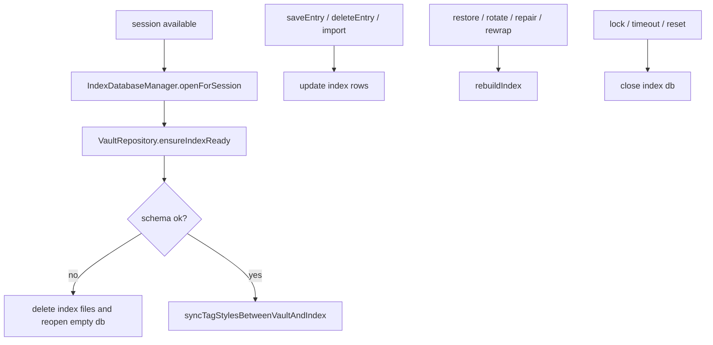

# 索引資料庫

這份文件整理 Quill Diary 目前的搜尋索引資料庫，包括它為什麼存在、實際存了哪些資料、何時開啟、何時同步、何時關閉，以及什麼情況下會重建。

它只講索引本身，不重講解鎖流程、備份全貌或草稿細節。

## 先講結論

- `index/journal_index.sqlite` 是加密的衍生索引，不是真實資料來源；權威資料仍在 `vault/`。
- 索引生命週期綁在有效解鎖 session 上，但首頁查詢會透過 `indexQueryableVaultSessionProvider` 做一層中介。
- 日常解鎖只會開啟索引、檢查 schema、同步 tag style，不會順手全量掃描 `vault/`。
- 真正的全量 `rebuildIndex()` 只在少數需要重新把 vault 正式內容對齊回索引的情境發生，主要包含 restore 後沿用舊 session、Recovery Key 解鎖、Recovery Key rotate / trusted device rewrap、repair，或明確重建。

## 索引資料庫在做什麼

正式日記與附件都在 `vault/`，搜尋不會每次都重新打開加密 entry 檔逐篇掃描。

因此 Quill Diary 另外維護一份加密 SQLite 索引，目的很明確：

- 加速首頁搜尋、日曆、時間範圍瀏覽與部分列表顯示
- 保存搜尋所需的正規化文字與輔助摘要
- 讓索引可以獨立刪除與重建，而不影響正式 vault

這代表：

- 索引是快取與衍生資料
- 它可以被重建
- 它不能取代正式 vault

## 路徑與加密

- 路徑：`{appSupport}/quill_diary/index/journal_index.sqlite`
- 位置與 `vault/` 分開，由 `VaultPathStrategy.indexDatabasePath()` 提供
- 索引金鑰由 `recoveryWrapKey + vaultId` 經 HKDF-SHA256 衍生
- HKDF 參數：
  - secret：`recoveryWrapKey`
  - nonce：`utf8(vaultId)`
  - info：`AppIdentifiers.indexKeyDerivationInfo`
  - output length：`32`

也就是說，索引雖然是衍生資料，仍然受目前 vault session 保護，不會以明文 SQLite 留在裝置上。

## 實際有哪些表

[`IndexDatabase`](../../../lib/infrastructure/database/index_database.dart) 目前會建立以下表：

| 資料表 | 用途 |
|--------|------|
| `entries_index` | 每篇日記的主索引資料 |
| `entry_tags` | 每篇日記對應的 tag 與 `tag_normalized` |
| `entry_attachments` | 附件摘要，用來支援附件計數與預覽圖路徑 |
| `app_kv` | 索引內部狀態與同步旗標 |
| `tag_styles` | tag accent color 快取 |

這表示索引不只存「可搜尋文字」，還包含首頁顯示與同步控制需要的輔助資料。

## `entries_index` 目前存什麼

主表 `entries_index` 目前包含至少以下欄位：

- `id`
- `vault_id`
- `file_path`
- `title`
- `title_search_text`
- `preview_text`
- `preview_markdown`
- `body_search_text`
- `date`
- `created_at`
- `updated_at`
- `word_count`
- `char_count`
- `attachment_count`
- `has_attachments`
- `encrypted_file_size`
- `encrypted_file_mtime`
- `content_hash`

用途拆開看：

- `title_search_text`、`body_search_text`：搜尋用
- `preview_text`、`preview_markdown`：首頁與預覽顯示用
- `word_count`、`char_count`：摘要統計用
- `attachment_count`、`has_attachments`：列表與 UI 狀態用
- `encrypted_file_size`、`encrypted_file_mtime`、`content_hash`：同步、修復與重建判斷輔助資訊

## 搜尋到底怎麼做

首頁搜尋最終仍是 SQL `LIKE` 比對，但不是對原始 Markdown 原文直接查。

目前命中欄位包括：

- `entries_index.title_search_text`
- `entries_index.body_search_text`
- `entry_tags.tag_normalized`

查詢流程：

1. 使用者輸入搜尋字串
2. `IndexDatabase.searchEntries()` 先做 `normalizeSearchText(query)`
3. 產生 `%normalizedQuery%`
4. 以 `LIKE` 比對 title / body / normalized tags

補充：

- `preview_text` 不參與搜尋，它只是顯示摘要
- `body_search_text` 來自 Markdown 正規化結果，不是原始 Markdown 原文
- `searchableTextFromMarkdown()` 會移除像 task checkbox 這類標記，但保留可搜尋的文字內容

## 附件與預覽資料為什麼也在索引裡

索引查詢回傳的是 `EntryIndexRecord`，它不只帶搜尋欄位，還帶這些輔助資訊：

- `tags`
- `attachmentCount`
- `imageAttachmentCount`
- `fileAttachmentCount`
- `previewImagePaths`
- `previewMarkdown`

這些資料來自：

- `entry_tags`
- `entry_attachments`
- `entries_index.preview_markdown`

因此首頁列表、日曆與一些摘要畫面可以直接走索引，而不必每次都反解 vault entry。

## `app_kv` 在存什麼

索引內還有一張 `app_kv` 表，用來保存索引自身狀態，而不是正式日記資料。

目前會用到的 key 包括：

- `last_rebuild_at`
- `index_generation`
- `rewrap_in_progress`
- `rewrap_started_at`
- `keystore_wrap_mode`

用途如下：

| key | 用途 |
|-----|------|
| `last_rebuild_at` | 最近一次全量重建時間 |
| `index_generation` | 最近一次重建使用的索引 generation |
| `rewrap_in_progress` | trusted device rewrap 是否進行中 |
| `rewrap_started_at` | rewrap 開始時間 |
| `keystore_wrap_mode` | 目前 trusted device 保護對應的 auth kind 後綴 |

重點：

- 這些值屬於索引或解鎖同步狀態
- 它們不是正式日記內容
- 它們丟失時通常可以重新推導、重新同步或重新建立

## tag style 和索引的關係

tag 樣式的權威來源不是 SQLite，而是：

- `vault/tag_styles.json`

SQLite 內的 `tag_styles` 表只是 accent color 快取。

`syncTagStylesBetweenVaultAndIndex()` 目前做的事很單純：

1. 從 vault 讀 tag catalog / style
2. 把有 accent color 的 tag 寫入索引 `tag_styles`

因此：

- 搜尋索引可以幫 UI 快速取顏色
- 但它不能成為 tag style 的唯一來源

## 生命週期

高層原則：

- 有有效 session 才能開
- 鎖定後就關
- 日常解鎖不自動全量 rebuild
- 大改動或不一致時才 rebuild

## `openForSession` 做什麼

`IndexDatabaseManager.openForSession()` 負責把目前 session 綁到索引，不負責重掃 vault。

實際行為：

1. 若資料庫已開啟且 `vaultId` 相同，直接重用
2. 否則先 `close()`
3. 由 `recoveryWrapKey` 與 `vaultId` 衍生 SQLCipher key
4. 開啟加密 SQLite 並 `initialize()`
5. 若屬 unreadable encrypted index error，刪檔後再重開一次

這裡的重點是：

- `openForSession()` 只保證索引可以被安全開啟
- 它不判斷內容是不是最新
- 也不做全量 rebuild

## `ensureIndexReady` 做什麼

`VaultRepository.ensureIndexReady()` 是「解鎖後讓索引可用」的主要入口。

目前流程：

1. `_openIndexForSession(session)`
2. `hasExpectedIndexSchema()`
3. 若 schema 不符：
   - `deleteDatabaseFiles()`
   - 再開一次空索引
   - 直接返回，不順手全量掃描 vault
4. 若 schema 正常：
   - `syncTagStylesBetweenVaultAndIndex()`

也就是說，`ensureIndexReady()` 的責任是：

- attach session
- 驗證 schema
- 同步 tag style

不是：

- 全量重建索引
- 強制追平所有 entry

## schema 檢查目前在看什麼

`hasExpectedIndexSchema()` 目前至少會檢查：

- `entries_index` 是否存在必要欄位
- 是否出現已移除欄位

目前被視為「舊 schema 痕跡」的欄位包括：

- `mood`
- `schema_version`

而必要欄位至少包括：

- `id`
- `vault_id`
- `file_path`
- `title_search_text`
- `body_search_text`
- `date`
- `created_at`
- `updated_at`
- `word_count`
- `char_count`
- `attachment_count`
- `has_attachments`
- `content_hash`

如果這些條件不符，策略不是 migration，而是直接視為需要重置索引。

## 與 Session 的關係

| 時機 | 動作 |
|------|------|
| trusted unlock 成功 | `ensureIndexReady()` |
| Recovery Key 解鎖成功 | 底層解鎖流程會 `rebuildIndex()`；回到 application 層後再 `ensureIndexReady()` |
| restore 後 resume 舊 session | `ensureIndexReady()` + `rebuildIndex()` |
| lock / timeout / reset | `closeUnlockedResources()`，索引關閉 |
| session 不可用 | `indexQueryableVaultSessionProvider` 會讓首頁查詢回傳空結果 |

這裡有一個重要實作細節：

- 首頁與日曆 query provider 主要不是直接看 `activeVaultSessionProvider`
- 而是看 `indexQueryableVaultSessionProvider`

這個中介 provider 會在 `unlocking` 過程暫時保留上一個已知 session，避免索引查詢視圖瞬間斷掉。

## 何時同步索引內容

索引不是每次輸入文字就更新，它跟著正式資料寫入走。

目前原則：

- 草稿編輯中不進索引
- `saveEntry()` 正式提交後會更新 `entries_index`、`entry_tags`、`entry_attachments`
- 刪除 entry 時會同步移除對應索引資料
- portable import / restore 完成後，必要時透過正式 rebuild 追平

因此搜尋看到的永遠是：

- 已正式寫進 vault 的內容
- 不是尚未提交的 draft

## `rebuildIndex()` 實際在做什麼

全量 `rebuildIndex()` 會：

1. 清空 `entries_index`、`entry_tags`、`entry_attachments`
2. 掃描 vault 內正式 entries
3. 解析每篇 entry、附件與搜尋欄位
4. 重新寫入索引
5. 更新 `last_rebuild_at`
6. 更新 `index_generation`
7. 同步 tag style
8. 清理與既有 entry 不相容的 pinned state

這表示 rebuild 不只是「把搜尋字串重做一次」，而是把整份索引快取重新建立。

## 何時會全量重建

常見觸發時機包括：

- restore 後重新接手 session
- 使用 Recovery Key 解鎖後需要重建
- Recovery Key 輪替或 trusted device rewrap 完成後
- 設定頁 repair vault
- 需要把 vault 正式內容與索引重新對齊時

補充：

- `ensureIndexReady()` 本身不做全量 rebuild
- schema 不符時，它只會刪檔重開空庫
- 因此若剛重置成空庫，後續是否有內容，取決於之後有沒有進入 rebuild 路徑

## 什麼情況下會直接清空或丟棄索引

以下情況會優先走「清掉再重來」而不是複雜修補：

- SQLCipher key 不符或索引無法讀取
- schema 缺欄、留有已移除欄位
- restore/import 後需要重新建立一致狀態
- 使用者明確走 repair / rebuild 路徑

這是刻意的設計選擇：索引是衍生資料，可以丟；vault 正式資料才是不能亂丟的本體。

## 與其他模組的邊界

- 草稿不進索引，請看 [日記編輯器.md](../功能/日記編輯器.md)
- 索引金鑰如何由 `recoveryWrapKey` 衍生，請看 [加密格式.md](../安全/加密格式.md)
- 備份與還原怎麼影響索引重建，請看 [備份與還原.md](../功能/備份與還原.md)
- session 何時解鎖、鎖定與恢復，請看 [解鎖與會話.md](../安全/解鎖與會話.md)
- 系統分層與 storage / database 邊界，請看 [系統架構.md](../架構/系統架構.md)

## 主要程式位置

| 主題 | 位置 |
|------|------|
| 索引 schema 與查詢 | [`index_database.dart`](../../../lib/infrastructure/database/index_database.dart) |
| 索引開啟 / 關閉 / 刪檔 | [`index_database_manager.dart`](../../../lib/infrastructure/database/index_database_manager.dart) |
| 索引金鑰衍生 | [`index_key_derivation.dart`](../../../lib/infrastructure/database/index_key_derivation.dart) |
| vault 與索引同步、重建 | [`vault_repository.dart`](../../../lib/infrastructure/storage/vault_repository.dart) |
| 首頁查詢 provider | [`home_entry_query_providers.dart`](../../../lib/application/home/home_entry_query_providers.dart) |
| 相關測試 | [`ensure_index_ready_test.dart`](../../../test/infrastructure/storage/ensure_index_ready_test.dart) |

---

[← 返回開發文件導覽](../README.md)
